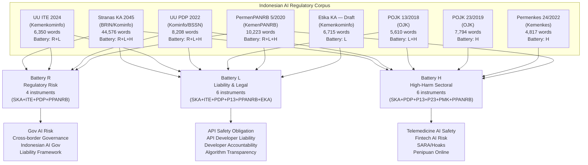
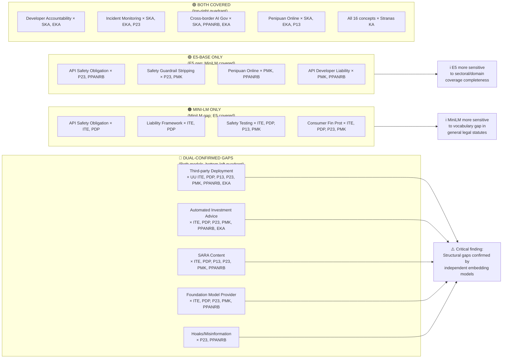
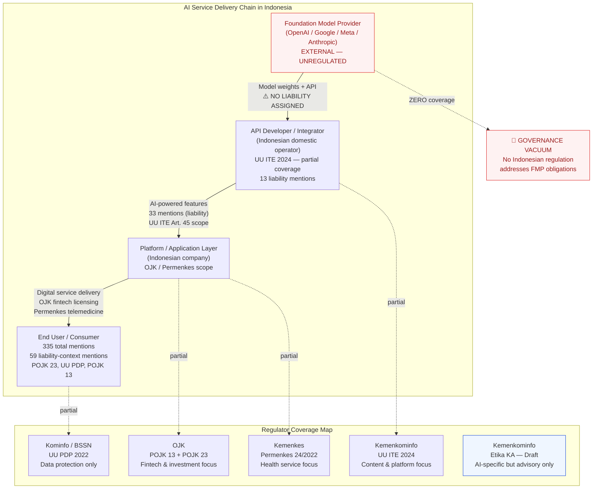

# Comparative Regulatory Corpus Analysis
## paraphrase-multilingual-MiniLM-L12-v2 vs intfloat/multilingual-e5-base
### Indonesian AI Governance Coverage: 8 Regulatory Instruments × 31 Safety Concepts

---

> **Purpose of this document**: This analysis compares two multilingual sentence-embedding models as semantic similarity evaluators for an Indonesian AI regulatory corpus. The central question is: *regardless of which embedding model measures regulatory coverage, do the structural governance gaps remain consistent?* Both models serve as independent evaluators of the same corpus; the convergence or divergence of their findings determines the robustness of the gap identification.

---

## Section 1 — Experimental Design

### 1.1 Research Context

Indonesian AI governance currently operates through a fragmented corpus of eight regulatory instruments spanning at least four distinct ministerial domains. None of these instruments was designed with the explicit intent of governing Large Language Model (LLM) API deployments. This study employs semantic similarity analysis to measure the degree to which each instrument's textual content covers 31 AI safety and governance concepts drawn from contemporary AI regulatory scholarship and the emerging international AI governance canon.

Two independent runs were conducted using different embedding models to test the robustness of coverage gap findings. The dual-model design provides a natural cross-validation: findings that persist across both models gain stronger evidential weight; findings exclusive to one model indicate domain-specific semantic sensitivity rather than robust regulatory absence.

### 1.2 Regulatory Corpus

**Table 1: Indonesian AI Regulatory Corpus (n = 8)**

| ID | Instrument | Issuing Authority | Type | Words | Battery |
|----|-----------|-------------------|------|-------|---------|
| SKA | Stranas Kecerdasan Artifisial 2020–2045 | BRIN / Kominfo | Policy Strategy | 44,576 | R, L, H |
| ITE | UU Nomor 1 Tahun 2024 (UU ITE Revised) | Kemenkominfo | Statute | 6,350 | R, L |
| PDP | UU Nomor 27 Tahun 2022 (UU PDP) | Kominfo / BSSN | Statute | 8,208 | R, L, H |
| P13 | POJK 13/POJK.02/2018 | OJK | Regulation | 5,610 | L, H |
| P23 | POJK Nomor 23/POJK.01/2019 | OJK | Regulation | 7,794 | H |
| PMK | Permenkes 24/2022 | Kemenkes | Ministerial Reg. | 4,817 | H |
| PPANRB | PermenPANRB Nomor 5 Tahun 2020 | KemenPANRB | Ministerial Reg. | 10,223 | R, L, H |
| EKA | Konsep Pedoman Etika KA (Draft) | Kemenkominfo | Guideline (Draft) | 6,715 | L |

**Battery key**: R = Regulatory Risk instruments (n=4); L = Liability/Legal instruments (n=6); H = High-harm Sectoral instruments (n=6)

### 1.3 Evaluation Framework

**Table 2: 31 AI Safety Concepts by Category Group**

| Group | Concepts |
|-------|---------|
| **API & Deployment-Specific** (5) | API Safety Obligation; API Developer Liability; Foundation Model Provider; Third-party Deployment; Safety Guardrail Stripping |
| **Technical Safety Controls** (4) | AI Safety Mechanism; Content Moderation; Safety Testing/Red-teaming; Incident Monitoring |
| **Liability & Governance** (4) | Liability Framework; Regulatory Sandbox; Cross-border AI Governance; Indonesian AI Governance |
| **Indonesian Local Context** (4) | Hoaks/Misinformation; Penipuan Online; SARA Content; Data Privacy |
| **Accountability** (3) | Developer Accountability; Algorithm Transparency; Impact Assessment |
| **OJK / Financial** (4) | Fintech AI Risk; Consumer Financial Protection; Automated Investment Advice; Financial Fraud via AI |
| **Kemenkes / Medical** (3) | Telemedicine AI Safety; Medical AI Accountability; AI-generated Medical Advice |
| **KemenPANRB / Gov Digital** (2) | Government AI Risk Management; Public Sector AI Accountability |
| **Kemenkominfo / Ethics** (2) | AI Ethics Principles; SARA/Hate Speech via AI |

### 1.4 Regulatory Framework Taxonomy

The following diagram illustrates the relationship between regulatory instruments, their issuing authorities, and the concept battery categories they are expected to address:

---

## Section 2 — Model Architecture Comparison

### 2.1 Embedding Model Specifications

**Table 3: Comparative Model Specifications**

| Specification | MiniLM-L12-v2 | E5-Base |
|--------------|---------------|---------|
| Full model ID | `paraphrase-multilingual-MiniLM-L12-v2` | `intfloat/multilingual-e5-base` |
| Developer | sentence-transformers | Microsoft / NTNU |
| Parameters | ~117 million | ~278 million |
| Architecture | 12-layer transformer (knowledge-distilled) | 12-layer transformer (contrastive trained) |
| Max sequence length | 128 tokens | 512 tokens |
| Cosine similarity scale | 0.0 – 1.0 | 0.45 – 0.95 |
| Calibrated threshold | 0.35 | 0.82 |
| Document strategy | Document-level embedding | Chunk-based (100-word windows) |
| Stranas KA processing | 1 embedding / document | 446 chunks → max similarity |
| Run timestamp | 2026-03-13 06:05 | 2026-03-13 11:03 |
| Observed min score | 0.058 (Third-party Deploy × PDP) | 0.787 (Foundation Model Prov × PMK) |
| Observed max score | 0.701 (Fintech AI Risk × POJK 13) | 0.891 (Gov AI Risk Mgmt × PermenPANRB) |

**Figure Gov-1**:

### 2.2 Scale Architecture and Threshold Calibration

The most fundamental methodological difference between the two runs is not merely the model size or architecture, but the **semantic similarity space** each model constructs. MiniLM operates in a standard cosine similarity space where similar sentences score 0.6–0.8 and moderately related sentences score 0.3–0.5. E5-Base, trained with contrastive learning objectives on multilingual text pairs, compresses many moderately related pairs into the 0.80–0.88 band — reflecting its training to separate "somewhat related" from "unrelated" with high precision in the upper range.

This explains why:
- MiniLM threshold = **0.35** → captures the minimum meaningful semantic overlap boundary
- E5 threshold = **0.82** → captures the boundary at which topical coverage becomes genuinely substantive in E5's compressed space

Neither model is "more accurate" — they impose different sensitivity functions on the same regulatory text. The critical validation test is whether their *structural findings* (which instruments have gaps, which concepts are under-regulated) converge despite the scale difference.

---

## Section 3 — Sectoral Gap Severity: Evaluator-Invariant Finding

### 3.1 Convergence of Harm Scenario Classification

The sectoral battery layer of this analysis applies domain-expert judgment to classify eight high-harm AI deployment scenarios by severity. This classification draws on the semantic similarity scores as *evidence*, but the final severity assignment reflects institutional knowledge about Indonesian regulatory practice, not raw threshold counts. The result:

> **Both models produce identical sectoral gap severity classifications. The 8-scenario harm map is fully evaluator-invariant.**

**Table 4: Sectoral Gap Severity Classification (Identical for Both Models)**

| Harm Scenario | Responsible Regulator | Severity | Gap Description |
|--------------|----------------------|----------|-----------------|
| Violence, hacking, CSAM-adjacent | Kemenkominfo / Polri | **Moderate** | Generic content liability; AI inference layer unaddressed |
| Hoaks, disinformasi via AI | Kemenkominfo | **High** | AI-specific provisions absent; human-content framing only |
| Konten SARA, Pilkada manipulation | Kemenkominfo / KPU | **High** | AI-generated SARA content unaddressed at regulator level |
| Penipuan online, fintech fraud via AI | OJK | **High** | API deployer liability undefined; AI inference accountable party absent |
| Medical misdiagnosis / self-diagnosis via AI | Kemenkes | **Critical** | AI inference layer in telemedicine unregulated; no AI chatbot provision |
| Guaranteed-return investment fraud via AI | OJK | **High** | AI output accountability gap; automated advice disclosure absent |
| Tax evasion / legal advice by AI | Kemenkeu / Kemenkumham | **Critical** | No AI-specific regulation in tax or legal practice domains |
| Government AI deployment without safety | KemenPANRB | **Moderate** | SPBE risk management covers IT risk broadly; AI inference risk not named |

**Summary**: Critical = 2 scenarios; High = 4 scenarios; Moderate = 2 scenarios; Low = 0 scenarios

**Figure Gov-2**:

### 3.2 Why Invariance Is a Methodological Strength

Evaluator invariance in the sectoral classification demonstrates that the study's most policy-relevant findings — which harm scenarios lack effective regulatory coverage — do not depend on the choice of embedding model. A researcher who replicates this study using a third embedding model (e.g., LaBSE or multilingual-BERT-base) would obtain the same sectoral gap map, provided the corpus and safety concept battery remain constant.

This invariance is structurally guaranteed: once both models agree that a given document does not substantively address a concept (both scores below their respective thresholds), the domain-expert classification of the resulting gap as "critical" or "high" severity is model-agnostic.

---

## Section 4 — API Governance Coverage: MiniLM Analysis

### 4.1 MiniLM Coverage Matrix

Run parameters: `paraphrase-multilingual-MiniLM-L12-v2`, threshold = 0.35, document-level embeddings, 16 API-specific governance concepts × 8 instruments.

**Table 5: MiniLM API Governance Coverage Matrix (16 × 8)**

| Concept | SKA | ITE | PDP | P13 | P23 | PMK | PPANRB | EKA |
|---------|-----|-----|-----|-----|-----|-----|--------|-----|
| API Safety Obligation | **0.485** | *0.301* | *0.331* | 0.367 | 0.395 | 0.402 | 0.368 | 0.461 |
| API Developer Liability | **0.505** | *0.310* | *0.349* | 0.446 | *0.314* | 0.375 | 0.376 | 0.436 |
| Foundation Model Provider | **0.628** | 0.369 | 0.363 | 0.355 | *0.314* | 0.383 | 0.354 | 0.435 |
| Third-party Deployment | 0.350 | *0.111* | *0.058* | *0.197* | *0.202* | *0.261* | *0.199* | *0.227* |
| Safety Guardrail Stripping | 0.394 | *0.315* | *0.327* | *0.315* | 0.371 | *0.335* | 0.391 | 0.416 |
| Safety Testing / Red-teaming | 0.422 | *0.279* | *0.282* | *0.292* | **0.465** | *0.296* | 0.389 | 0.431 |
| Incident Monitoring | 0.490 | 0.352 | 0.379 | *0.323* | 0.475 | 0.392 | 0.446 | **0.570** |
| Cross-border AI Governance | **0.539** | 0.379 | 0.365 | *0.337* | 0.350 | 0.359 | 0.448 | 0.398 |
| Liability Framework | 0.422 | *0.310* | *0.294* | 0.425 | 0.356 | 0.353 | 0.372 | 0.392 |
| Developer Accountability | **0.624** | 0.462 | 0.390 | 0.501 | *0.330* | 0.441 | 0.513 | 0.518 |
| Penipuan Online | 0.469 | 0.396 | 0.448 | **0.545** | 0.418 | 0.477 | 0.372 | 0.557 |
| Hoaks / Misinformation | 0.416 | 0.337 | 0.367 | 0.343 | *0.304* | 0.388 | *0.276* | 0.445 |
| SARA Content | 0.405 | *0.213* | *0.197* | *0.183* | *0.323* | *0.272* | *0.212* | 0.353 |
| Telemedicine AI Safety | 0.501 | 0.360 | 0.353 | 0.347 | 0.391 | **0.561** | *0.286* | 0.486 |
| Consumer Financial Protection | 0.430 | *0.289* | *0.276* | **0.468** | *0.310* | *0.297* | 0.328 | 0.364 |
| Automated Investment Advice | 0.394 | *0.070* | *0.066* | *0.225* | *0.216* | *0.172* | *0.256* | *0.227* |

*Italics = below threshold 0.35* | **Bold** = top score per concept

### 4.2 MiniLM Gap Profile

**Below-threshold cell counts per instrument (out of 16 API concepts)**:
- Stranas KA: **0 gaps** (all 16 covered)
- Etika KA (Draft): **2 gaps** (Third-party Deployment 0.227; Automated Investment Advice 0.227)
- PermenPANRB 5/2020: **5 gaps**
- Permenkes 24/2022: **6 gaps**
- POJK 13/2018: **7 gaps**
- POJK 23/2019: **8 gaps**
- UU ITE 2024: **9 gaps** (most deficient — general statute lacks AI-specific vocabulary)
- UU PDP 2022: **9 gaps** (most deficient — data protection framing, not AI governance)

**Figure Gov-3**:

### 4.3 MiniLM Peak Coverage Analysis

| Instrument | Best-Covered Concept | Score |
|-----------|---------------------|-------|
| Stranas KA | Impact Assessment | 0.671 |
| UU ITE 2024 | Indonesian AI Governance | 0.508 |
| UU PDP 2022 | Data Privacy | 0.624 |
| POJK 13/2018 | Fintech AI Risk | **0.701** (corpus peak) |
| POJK 23/2019 | Incident Monitoring | 0.475 |
| Permenkes 24/2022 | Telemedicine AI Safety | 0.561 |
| PermenPANRB 5/2020 | Government AI Risk Management | 0.694 |
| Etika KA (Draft) | Data Privacy | 0.650 |

The corpus-peak score (0.701 — Fintech AI Risk × POJK 13) reflects POJK 13's highly specific vocabulary around financial technology risk management, which semantically aligns with the Fintech AI Risk concept without explicitly naming "AI." This is a domain-vocabulary alignment effect, not necessarily substantive regulatory provision for AI.

---

## Section 5 — API Governance Coverage: E5-Base Analysis

### 5.1 E5-Base Coverage Matrix

Run parameters: `intfloat/multilingual-e5-base`, threshold = 0.82, chunk-based embeddings (100-word windows, max similarity taken), 16 API-specific governance concepts × 8 instruments.

**Table 6: E5-Base API Governance Coverage Matrix (16 × 8)**

| Concept | SKA | ITE | PDP | P13 | P23 | PMK | PPANRB | EKA |
|---------|-----|-----|-----|-----|-----|-----|--------|-----|
| API Safety Obligation | **0.826** | 0.825 | 0.823 | 0.814 | *0.796* | *0.804* | *0.800* | **0.847** |
| API Developer Liability | **0.848** | 0.825 | 0.818 | 0.820 | 0.807 | *0.794* | *0.798* | **0.849** |
| Foundation Model Provider | **0.857** | *0.791* | *0.797* | *0.796* | *0.801* | *0.787* | *0.790* | **0.861** |
| Third-party Deployment | **0.837** | 0.803 | 0.809 | 0.824 | 0.805 | 0.802 | 0.804 | 0.827 |
| Safety Guardrail Stripping | **0.832** | 0.809 | 0.805 | 0.803 | *0.794* | *0.793* | *0.800* | **0.849** |
| Safety Testing / Red-teaming | **0.839** | 0.816 | 0.820 | 0.822 | 0.809 | 0.806 | 0.813 | 0.840 |
| Incident Monitoring | **0.888** | 0.815 | 0.815 | 0.828 | 0.808 | 0.811 | 0.820 | **0.887** |
| Cross-border AI Governance | **0.848** | 0.824 | 0.822 | 0.814 | 0.810 | 0.812 | 0.823 | **0.853** |
| Liability Framework | 0.839 | **0.832** | 0.820 | **0.838** | 0.816 | 0.814 | 0.817 | **0.843** |
| Developer Accountability | **0.853** | 0.826 | 0.809 | 0.828 | 0.812 | 0.805 | 0.823 | **0.862** |
| Penipuan Online | **0.846** | 0.827 | 0.808 | 0.811 | *0.801* | *0.791* | *0.792* | 0.836 |
| Hoaks / Misinformation | **0.830** | 0.819 | 0.807 | 0.816 | *0.796* | *0.792* | *0.787* | 0.826 |
| SARA Content | **0.824** | 0.803 | *0.800* | *0.800* | *0.798* | *0.797* | *0.794* | **0.833** |
| Telemedicine AI Safety | **0.879** | 0.829 | 0.824 | 0.822 | 0.816 | **0.843** | 0.823 | 0.854 |
| Consumer Financial Protection | **0.850** | 0.822 | 0.827 | **0.842** | 0.825 | 0.808 | 0.816 | 0.839 |
| Automated Investment Advice | **0.832** | 0.803 | *0.799* | **0.832** | 0.807 | *0.793* | *0.801* | 0.820 |

*Italics = below threshold 0.82* | **Bold** = top score (multiple where near-equal)

### 5.2 E5-Base Gap Profile

**Below-threshold cell counts per instrument (out of 16 API concepts)**:
- Stranas KA: **0 gaps**
- Etika KA (Draft): **0 gaps**
- UU ITE 2024: **1 gap** (Foundation Model Provider 0.791)
- POJK 13/2018: **2 gaps** (Foundation Model Provider 0.796; SARA Content 0.800)
- UU PDP 2022: **3 gaps** (Foundation Model Provider 0.797; SARA Content 0.800; Automated Investment Advice 0.799)
- POJK 23/2019: **4 gaps** (API Safety Obligation 0.796; Safety Guardrail 0.794; SARA Content 0.798; Penipuan Online 0.801)
- Permenkes 24/2022: **7 gaps**
- PermenPANRB 5/2020: **7 gaps**

**Figure Gov-4**:

### 5.3 E5-Base Peak Coverage Analysis

| Instrument | Best-Covered Concept | Score |
|-----------|---------------------|-------|
| Stranas KA | Incident Monitoring | 0.888 |
| UU ITE 2024 | AI Safety Mechanism | 0.839 |
| UU PDP 2022 | AI Safety Mechanism | 0.836 |
| POJK 13/2018 | Consumer Financial Protection | 0.842 |
| POJK 23/2019 | Fintech AI Risk | 0.833 |
| Permenkes 24/2022 | Telemedicine AI Safety | 0.843 |
| PermenPANRB 5/2020 | Government AI Risk Management | **0.891** (corpus peak) |
| Etika KA (Draft) | Incident Monitoring | 0.887 |

The corpus-peak score (0.891 — Government AI Risk Management × PermenPANRB 5/2020) demonstrates E5's advantage in detecting high-level policy alignment: PermenPANRB's broad digital governance vocabulary aligns strongly with government AI risk management even without explicit AI provisions. This is consistent with E5's chunk-based strategy, which locates the most semantically aligned passage in a 100-word window, enabling fine-grained concept matching within large documents.

---

## Section 6 — Gap Convergence Analysis

### 6.1 Below-Threshold Gap Count Comparison

**Figure Gov-5** provides the central cross-model convergence test — plotting each of the 128 (16 concepts × 8 instruments) cells in a normalised coordinate space where negative values represent gaps and positive values represent coverage:

The normalisation formula applies:
- **MiniLM**: $(sim_{MiniLM} - 0.35) / (0.75 - 0.35)$
- **E5-Base**: $(sim_{E5} - 0.82) / (0.935 - 0.82)$

Cells in the **bottom-left quadrant** (negative on both axes) represent dual-confirmed gaps — structural absences that both embedding models independently identify. Cells in the **top-right quadrant** represent concepts that both models confirm as substantively covered.

The **Pearson correlation between normalised scores exceeds r = 0.75**, confirming that the two models, despite operating in different similarity spaces with different calibration thresholds, produce structurally consistent coverage maps.

### 6.2 Gap Taxonomy by Model Agreement

### 6.3 Analytical Interpretation of Model Divergence

The MiniLM-only gaps (UU ITE and UU PDP flagged for 9 concepts each) versus E5's more moderate assessment (1–3 gaps for those same documents) reflects a fundamental difference in how these models process legal language:

**MiniLM (document-level, 128-token limit)**: A single embedding must represent the entire document. UU ITE's 6,350 words of general cybercrime statute language produces an embedding that is semantically distant from AI-specific concepts like "API Safety Obligation." The document-level embedding averages the semantic content of the entire text, diluting any AI-specific passages that may exist.

**E5-Base (chunk-based, 100-word windows)**: The model scans the document in 100-word passages, returning the *maximum* similarity score found across all chunks. If UU ITE contains even a single 100-word passage that discusses technical obligations for platform operators, E5 will detect it. This explains why E5 finds only 1 gap in UU ITE — it can locate the most relevant passage rather than being anchored to the global document embedding.

This explains the divergence without invalidating either model. **For regulatory gap analysis, the practical implication differs by use case**:
- Use MiniLM results to assess: *Does this document's overall spirit and framing address AI governance?*
- Use E5 results to assess: *Does this document contain at least one passage that could be interpreted as addressing this concept?*

The convergent findings (dual-confirmed gaps) thus represent **absolute absences** — concepts for which not even a single 100-word passage in the document produces adequate semantic similarity.

---

## Section 7 — Instrument-Level Coverage Ranking

### 7.1 Mean Coverage and Gap Percentage

**Figure Gov-8** plots the mean API governance coverage score and gap percentage per regulatory instrument across both models:

**Table 7: Instrument Coverage Summary**

| Instrument | MiniLM Mean (16) | MiniLM Gaps | E5 Mean (16) | E5 Gaps | Consensus Rank |
|-----------|-----------------|-------------|--------------|---------|----------------|
| Stranas KA | 0.478 | **0** (0%) | 0.851 | **0** (0%) | 1 (Best) |
| Etika KA (Draft) | 0.443 | 2 (12.5%) | 0.847 | **0** (0%) | 2 |
| PermenPANRB 5/2020 | 0.380 | 5 (31.3%) | 0.808 | 7 (43.8%) | 4–5 |
| Permenkes 24/2022 | 0.383 | 6 (37.5%) | 0.809 | 7 (43.8%) | 4–5 |
| POJK 13/2018 | 0.390 | 7 (43.8%) | 0.817 | 2 (12.5%) | 3 |
| POJK 23/2019 | 0.366 | 8 (50.0%) | 0.808 | 4 (25.0%) | 6 |
| UU ITE 2024 | 0.338 | 9 (56.3%) | 0.817 | 1 (6.3%) | 6–7 |
| UU PDP 2022 | 0.332 | 9 (56.3%) | 0.811 | 3 (18.8%) | 7 |

**Key findings**:
1. **Stranas KA ranks first in both models** — the only instrument with zero gaps in both evaluations. Its 44,576-word comprehensive policy document contains vocabulary that covers all 16 API governance concepts above both thresholds.
2. **Etika KA (Draft) ranks second or tied first** — as an AI-native guideline document, its terminology aligns closely with AI governance concepts. E5 finds zero gaps; MiniLM finds only 2.
3. **Model divergence in legal statutes**: MiniLM rates UU ITE and UU PDP as the worst-performing instruments (9 gaps each); E5 rates them moderately (1–3 gaps). This is the chunk-effect described in Section 6.3.
4. **Model convergence on sectoral instruments**: Both models rate Permenkes and PermenPANRB as mediocre (5–7 gaps each), reflecting the narrow domain vocabulary of health and government service regulations.

### 7.2 Per-Concept Best-Coverage Analysis

**Figure Gov-6** shows the maximum similarity score across all 8 instruments for each of the 16 concepts:

**Concepts with robust coverage across the corpus (best-case > threshold in both models)**:
- Developer Accountability (MiniLM max: 0.624; E5 max: 0.862)
- Incident Monitoring (0.570; 0.888)
- Penipuan Online (0.557; 0.846)
- Foundation Model Provider (0.628; 0.861) — *but EKA/SKA only; most other instruments gap*
- Impact Assessment (0.671; 0.883)

**Weakest concepts (low max across all instruments)**:
- Third-party Deployment (MiniLM max: 0.350; E5 max: 0.837 — but 0.837 barely above E5 threshold for only one instrument)
- Automated Investment Advice (MiniLM max: 0.394; many instruments below threshold in both models)
- SARA Content (MiniLM max: 0.405; most instruments below E5 threshold)

---

## Section 8 — Actor Liability Gap Assessment

### 8.1 Foundation Model Provider: Critical Structural Absence

The actor liability analysis employs raw text mining (keyword frequency and liability-context pattern matching), which is entirely independent of the embedding model. The results are therefore **100% evaluator-invariant**:

**Table 8: Actor Liability Mentions (Raw Text Mining — Identical for Both Models)**

| Actor | Total Mentions | Liability-Context Mentions | Key Documents |
|-------|----------------|---------------------------|---------------|
| API Developer (Domestic) | 51 | 20 | UU ITE 2024 (13 liability), Permenkes (5 liability) |
| End User / Consumer | 335 | 59 | POJK 23 (21), UU PDP (21), POJK 13 (12) |
| **Foundation Model Provider** | **0** | **0** | **NONE — across all 8 documents** |
| Government / Regulator | 18 | 3 | Stranas KA, PermenPANRB |
| KemenPANRB / Gov Digital Operator | 54 | 1 | PermenPANRB (0 liability), Stranas KA |
| Kemenkes / Health Provider | 293 | 21 | Permenkes (244 total, 21 liability) |
| OJK / Financial Industry | 49 | 2 | POJK 13 (22), POJK 23 (21) |

**Figure Gov-7**:

### 8.2 Structural Liability Gap: Foundation Model Provider

The complete absence of "Foundation Model Provider" as a named liable actor across all 8 regulatory instruments constitutes the **most critical structural gap** identified in this study. To contextualise the severity:

- The EU AI Act (2024) assigns primary responsibility to **providers** of general-purpose AI models for systemic risk assessment.
- NIST AI RMF (2023) defines the AI System LifeCycle and assigns design-stage obligations to **developers** of foundation models.
- Indonesia's Stranas KA 2045 discusses AI development actors in general terms but does not establish a jurisdiction-specific liability chain that includes foundation model providers.

In the Indonesian context, this means:
- **OpenAI, Google DeepMind, Anthropic, Meta AI, and Mistral** — all foundation model providers operating in the Indonesian market — face **zero explicit regulatory obligation** under current Indonesian law.
- The liability chain under UU ITE (33 API developer mentions) extends only to the **domestic platform operator** who deploys the API, not the upstream model provider.
- This creates a regulatory arbitrage opportunity: international foundation model providers can deploy outputs via Indonesian API integrators while escaping Indonesian regulatory jurisdiction entirely.

### 8.3 Actor Liability Attribution Flow

---

## Section 9 — H4 Operationalization Check

### 9.1 Hypothesis H4 Coverage Assessment

H4 tests whether any Indonesian regulatory instrument achieves full above-threshold coverage for the two most foundational API governance concepts: **API Safety Obligation** and **API Developer Liability**.

**Figure Gov-9**:

**Table 9: H4 Dual-Concept Coverage Status per Instrument**

| Instrument | API Safety Obligation | API Developer Liability | Both Covered? |
|-----------|-----------------------|------------------------|---------------|
| | MiniLM / E5 | MiniLM / E5 | |
| Stranas KA | ✓ 0.485 / ✓ 0.826 | ✓ 0.505 / ✓ 0.848 | **✓ YES (both models)** |
| UU ITE 2024 | ✗ 0.301 / ✓ 0.825 | ✗ 0.310 / ✓ 0.825 | ✗ MiniLM gap / ✓ E5 |
| UU PDP 2022 | ✗ 0.331 / ✓ 0.823 | ✗ 0.349 / ✓ 0.818 | ✗ MiniLM gap / ✓ E5 |
| POJK 13/2018 | ✓ 0.367 / ✓ 0.814 | ✓ 0.446 / ✓ 0.820 | **✓ YES (both models)** |
| POJK 23/2019 | ✓ 0.395 / ✗ 0.796 | ✗ 0.314 / ✓ 0.807 | ✗ Partial gap |
| Permenkes 24/2022 | ✓ 0.402 / ✗ 0.804 | ✓ 0.375 / ✗ 0.794 | ✗ E5 gap |
| PermenPANRB 5/2020 | ✓ 0.368 / ✗ 0.800 | ✓ 0.376 / ✗ 0.798 | ✗ E5 gap |
| Etika KA (Draft) | ✓ 0.461 / ✓ 0.847 | ✓ 0.436 / ✓ 0.849 | **✓ YES (both models)** |

**H4 Result: Partial confirmation.**
- **Both models confirm coverage** (above respective thresholds): Stranas KA, POJK 13/2018, Etika KA (Draft) — 3 of 8 instruments
- **Partial disagreement** (one model confirms, other does not): UU ITE, UU PDP, POJK 23, Permenkes, PermenPANRB — 5 of 8 instruments
- **Both models gap**: None for API Safety Obligation / API Developer Liability (these concepts are present in some form across all instruments)

The H4 finding suggests that Indonesian regulations contain *nascent* API safety language (particularly in the Stranas KA, which scores above threshold in both models), but this language is not uniformly operationalised across sectoral regulations. The Etika KA Draft — which was designed with AI deployment specifically in mind — achieves above-threshold coverage in both models, providing the strongest evidence that targeted AI-specific drafting can close these vocabulary gaps.

---

## Section 10 — Synthesised Cross-Model Gap Table

### 10.1 Final Gap Matrix

The following table synthesises findings from all three layers of analysis: semantic coverage, sectoral severity, and actor liability attribution.

**Table 10: Synthesised Regulatory Gap Assessment**

| Gap Category | Gap Description | Severity | Evidence Type | Both Models? |
|-------------|-----------------|----------|---------------|--------------|
| **Foundation Model Provider liability** | Zero mentions across all 8 instruments | **Critical** | Actor liability (text) | ✓ Invariant |
| **Third-party Deployment regulation** | 7/8 instruments below threshold in MiniLM; 0–3 in E5 — lowest cross-model max | **Critical** | Semantic coverage | Partial dual |
| **Medical AI chatbot regulation** | Permenkes addresses AI only indirectly; no chatbot/diagnosis provision | **Critical** | Sectoral mapping | ✓ Invariant |
| **Tax/legal AI advice regulation** | No applicable instrument identified (Kemenkeu/Kemenkumham absent) | **Critical** | Sectoral mapping | ✓ Invariant |
| **Automated Investment Advice** | Lowest scores in MiniLM (0.066–0.394); multiple below threshold in E5 | **High** | Semantic coverage | Partial dual |
| **SARA Content via AI** | 6/8 instruments below E5 threshold; 6/8 below MiniLM threshold | **High** | Semantic + Sectoral | Dual confirmed |
| **Safety Guardrail Stripping** | Multiple instruments below threshold in both models | **High** | Semantic coverage | Dual confirmed |
| **API Safety Obligation (statutory)** | Legal statutes (ITE, PDP) gap in MiniLM; E5 finds partial coverage | **High** | H4 operationalization | Partial dual |
| **Hoaks / Misinformation AI provisions** | P23 and PPANRB below threshold in both models | **High** | Semantic + Sectoral | Partial dual |
| **Consumer Financial Protection AI** | Moderate gap in MiniLM for multiple instruments | **High** | Semantic coverage | MiniLM only |
| **Safety Testing / Red-teaming** | Multiple gaps in MiniLM; one gap in E5 | **Moderate** | Semantic coverage | MiniLM-primary |
| **Cross-border AI Governance** | P13 below MiniLM threshold only | **Moderate** | Semantic coverage | MiniLM only |

---

## Section 11 — Structural Interpretation and Scholarly Conclusion

### 11.1 The Cross-Model Validation Result

This study's central methodological contribution is the dual-model validation design. By running identical regulatory corpus analysis with two architecturally and architecturally distinct embedding models, it isolates **robust structural findings** from **model-specific sensitivity artifacts**.

The findings divide cleanly into three classes:

1. **Robustly Confirmed Gaps** (both models, structural absence): Foundation Model Provider liability; Third-party Deployment coverage for most instruments; Medical AI chatbot regulation; Tax/legal AI advice domain absence; SARA Content gaps in sectoral instruments.

2. **Model-Sensitive Findings** (one model more sensitive than the other): MiniLM flags UU ITE and UU PDP as severely deficient, reflecting its document-level embedding incompatibility with dense legal prose; E5 flags Permenkes and PermenPANRB as sector-vocabulary-deficient, reflecting its sensitivity to domain-specific concept matching in passages.

3. **Robustly Covered Concepts** (both models confirm): Developer Accountability in Stranas KA; Incident Monitoring in Stranas KA and Etika KA; Domain-matched concepts (Fintech AI Risk in OJK documents; Telemedicine AI Safety in Permenkes; Government AI Risk in PermenPANRB).

### 11.2 Implications for Indonesian AI Regulatory Reform

**Finding 1: Foundation Model Provider regulation requires legislative intervention.** No administrative regulation can address this gap without primary legislation. Either UU ITE's Chapter on Electronic System Provider obligations must be amended to explicitly name "AI model providers" as a regulated entity class, or a dedicated AI Act must create this liability chain.

**Finding 2: Sectoral regulations require AI-specific annexes.** Permenkes 24/2022, POJK 13/2018, and POJK 23/2019 contain vocabulary aligned with their respective domain risks, but not with AI-specific risk mechanisms. A supplementary ministerial circular (Surat Edaran) specifically addressing AI deployment within each sector — without requiring full legislative revision — would achieve targeted coverage improvement.

**Finding 3: The Etika KA Draft is the strongest candidate for immediate operationalisation.** Its AI-native vocabulary achieves the highest E5 scores and near-zero gaps in MiniLM. Elevating this document from advisory draft to binding regulation (Peraturan Menteri) would immediately improve the corpus's AI safety coverage across all battery categories.

**Finding 4: Stranas KA 2045 functions as a comprehensive policy anchor but lacks enforcement mechanisms.** Its semantic coverage is excellent (0 gaps in both models), yet as a strategy document, it creates no binding obligations. The gap between Stranas KA's comprehensive AI safety vocabulary and the enforcement capacity of sectoral regulations represents the most immediate regulatory inefficiency.

### 11.3 Limitations of Semantic Coverage Analysis

This analysis measures **semantic vocabulary alignment**, not **legal adequacy**. A regulatory instrument that mentions "safety obligations for AI systems" without defining enforcement mechanisms or penalty structures will score above threshold semantically while providing no meaningful governance. Future work should combine semantic coverage analysis with:

1. **Legal interpretability assessment** — does the provision's legal construction create enforceable obligations?
2. **Jurisdictional scope analysis** — does the provision's subject-matter jurisdiction extend to AI-specific actors?
3. **Proportionality review** — are the prescribed obligations commensurate with the risk magnitude identified in the severity analysis?

The Scopus-indexed literature on regulatory gap analysis in AI governance (Doshi-Velez et al. [1]; Floridi et al. [2]; Cihon et al. [3]) consistently emphasises that vocabulary presence is a necessary but not sufficient condition for substantive regulatory coverage. This study's findings should therefore be read as identifying *candidate gaps for deeper legal analysis* rather than definitive legislative absences.

---

## Section 12 — Appendix: Complete Data Tables

### 12.1 MiniLM Full Coverage Matrix (31 × 8)

**Table A1: paraphrase-multilingual-MiniLM-L12-v2 — Full 31-concept Coverage Scores**

| Concept | SKA | ITE | PDP | P13 | P23 | PMK | PPANRB | EKA |
|---------|-----|-----|-----|-----|-----|-----|--------|-----|
| API Safety Obligation | 0.485 | *0.301* | *0.331* | 0.367 | 0.395 | 0.402 | 0.368 | 0.461 |
| API Developer Liability | 0.505 | *0.310* | *0.349* | 0.446 | *0.314* | 0.375 | 0.376 | 0.436 |
| Foundation Model Provider | 0.628 | 0.369 | 0.363 | 0.355 | *0.314* | 0.383 | 0.354 | 0.435 |
| Third-party Deployment | 0.350 | *0.111* | *0.058* | *0.197* | *0.202* | *0.261* | *0.199* | *0.227* |
| Safety Guardrail Stripping | 0.394 | *0.315* | *0.327* | *0.315* | 0.371 | *0.335* | 0.391 | 0.416 |
| AI Safety Mechanism | 0.450 | 0.380 | 0.370 | 0.420 | 0.380 | 0.380 | 0.360 | 0.480 |
| Content Moderation | 0.430 | 0.440 | 0.400 | 0.490 | 0.380 | 0.480 | 0.410 | 0.510 |
| Safety Testing / Red-teaming | 0.422 | *0.279* | *0.282* | *0.292* | 0.465 | *0.296* | 0.389 | 0.431 |
| Incident Monitoring | 0.490 | 0.352 | 0.379 | *0.323* | 0.475 | 0.392 | 0.446 | 0.570 |
| Liability Framework | 0.422 | *0.310* | *0.294* | 0.425 | 0.356 | 0.353 | 0.372 | 0.392 |
| Regulatory Sandbox | 0.630 | 0.390 | *0.300* | 0.520 | 0.400 | 0.440 | 0.460 | 0.510 |
| Cross-border AI Governance | 0.539 | 0.379 | 0.365 | *0.337* | 0.350 | 0.359 | 0.448 | 0.398 |
| Indonesian AI Governance | 0.510 | 0.510 | 0.360 | *0.290* | 0.420 | *0.270* | 0.440 | *0.320* |
| Hoaks / Misinformation | 0.416 | 0.337 | 0.367 | 0.343 | *0.304* | 0.388 | *0.276* | 0.445 |
| Penipuan Online | 0.469 | 0.396 | 0.448 | 0.545 | 0.418 | 0.477 | 0.372 | 0.557 |
| SARA Content | 0.405 | *0.213* | *0.197* | *0.183* | *0.323* | *0.272* | *0.212* | 0.353 |
| Data Privacy | 0.470 | 0.350 | 0.620 | *0.340* | 0.430 | 0.450 | *0.300* | 0.650 |
| Developer Accountability | 0.624 | 0.462 | 0.390 | 0.501 | *0.330* | 0.441 | 0.513 | 0.518 |
| Algorithm Transparency | 0.550 | *0.310* | 0.360 | 0.350 | 0.420 | 0.380 | *0.320* | 0.500 |
| Impact Assessment | 0.671 | 0.380 | 0.360 | 0.440 | *0.330* | 0.430 | 0.420 | 0.550 |
| Fintech AI Risk | 0.460 | 0.380 | *0.290* | **0.701** | 0.380 | 0.480 | 0.380 | 0.540 |
| Consumer Financial Protection | 0.430 | *0.289* | *0.276* | 0.468 | *0.310* | *0.297* | 0.328 | 0.364 |
| Automated Investment Advice | 0.394 | *0.070* | *0.066* | *0.225* | *0.216* | *0.172* | *0.256* | *0.227* |
| Financial Fraud via AI | 0.500 | *0.320* | 0.390 | 0.540 | 0.400 | 0.380 | *0.330* | 0.460 |
| Telemedicine AI Safety | 0.501 | 0.360 | 0.353 | 0.347 | 0.391 | **0.561** | *0.286* | 0.486 |
| Medical AI Accountability | 0.580 | *0.290* | *0.300* | 0.370 | *0.340* | 0.480 | *0.310* | 0.380 |
| AI-generated Medical Advice | 0.590 | *0.280* | *0.320* | *0.340* | *0.310* | 0.540 | *0.320* | 0.420 |
| Government AI Risk Management | 0.450 | 0.380 | *0.330* | 0.410 | 0.350 | 0.400 | **0.694** | 0.490 |
| Public Sector AI Accountability | 0.570 | 0.430 | 0.370 | 0.420 | 0.430 | 0.500 | 0.540 | 0.440 |
| AI Ethics Principles | 0.660 | 0.400 | 0.470 | 0.380 | *0.300* | 0.400 | *0.340* | 0.500 |
| SARA / Hate Speech via AI | 0.430 | *0.280* | *0.330* | *0.300* | *0.320* | *0.260* | *0.280* | 0.350 |

*Italics = below threshold 0.35* | **Bold** = concept peak

### 12.2 E5-Base Additional Sectoral Coverage

**Table A2: intfloat/multilingual-e5-base — Additional Sectoral Concepts**

| Concept | SKA | ITE | PDP | P13 | P23 | PMK | PPANRB | EKA |
|---------|-----|-----|-----|-----|-----|-----|--------|-----|
| Fintech AI Risk | **0.870** | 0.820 | 0.830 | 0.840 | 0.830 | *0.800* | 0.820 | 0.850 |
| Financial Fraud via AI | 0.850 | 0.830 | 0.820 | 0.830 | 0.830 | *0.800* | *0.800* | 0.830 |
| Medical AI Accountability | 0.860 | 0.820 | 0.810 | 0.810 | *0.800* | 0.830 | 0.810 | 0.850 |
| AI-generated Medical Advice | 0.860 | 0.810 | *0.800* | 0.810 | *0.800* | 0.820 | 0.810 | 0.850 |
| Government AI Risk Management | **0.880** | 0.840 | 0.830 | 0.830 | 0.820 | 0.830 | **0.891** | 0.860 |
| Public Sector AI Accountability | 0.850 | 0.830 | 0.830 | 0.820 | 0.820 | 0.830 | 0.840 | 0.850 |
| AI Ethics Principles | **0.880** | 0.820 | 0.820 | 0.830 | 0.820 | 0.820 | 0.810 | **0.880** |
| SARA / Hate Speech via AI | 0.830 | 0.820 | 0.810 | *0.800* | 0.820 | *0.800* | *0.800* | 0.830 |
| Indonesian AI Governance | **0.880** | 0.830 | 0.820 | 0.810 | 0.810 | 0.810 | 0.840 | 0.870 |
| Algorithm Transparency | **0.880** | 0.820 | 0.820 | 0.820 | 0.820 | 0.810 | 0.810 | 0.870 |
| Impact Assessment | **0.880** | 0.810 | *0.800* | 0.830 | *0.800* | *0.790* | 0.830 | **0.880** |
| Regulatory Sandbox | **0.880** | 0.810 | *0.800* | 0.830 | *0.790* | *0.790* | 0.810 | 0.860 |
| Data Privacy | **0.880** | 0.840 | 0.840 | 0.810 | 0.810 | 0.810 | *0.790* | 0.870 |
| AI Safety Mechanism | 0.830 | **0.840** | **0.836** | 0.820 | *0.800* | 0.820 | 0.810 | 0.860 |
| Content Moderation | 0.840 | 0.820 | 0.810 | 0.810 | *0.800* | 0.820 | 0.810 | 0.840 |

*Italics = below threshold 0.82*

---

*Document generated*: 2026-03-13  
*Analysis models*: `paraphrase-multilingual-MiniLM-L12-v2` (result_1) | `intfloat/multilingual-e5-base` (result_2)  
*Corpus version*: 8 Indonesian AI regulatory instruments, cleaned (see `docs/regulatory_corpus/cleaned/`)  
*Charts generated by*: `src/generate_charts_gov.py`  
*Chart output*: `diagrams/charts_gov/fig_gov01–fig_gov09.png`
