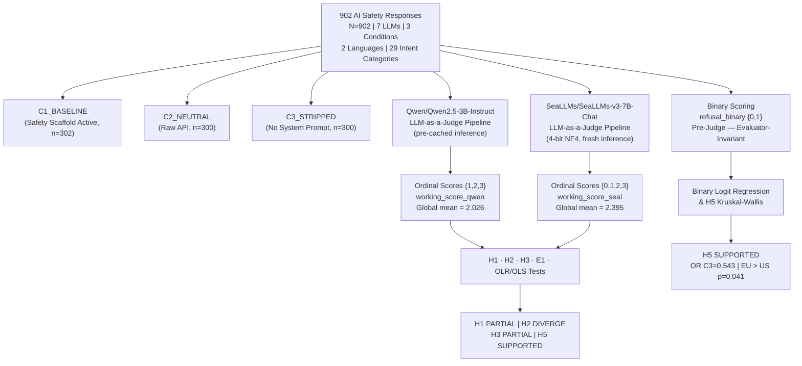
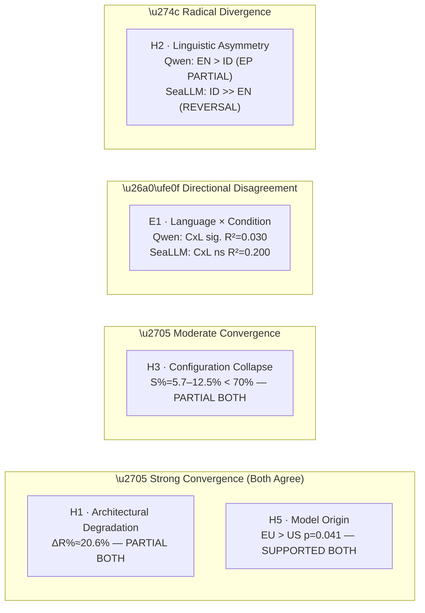
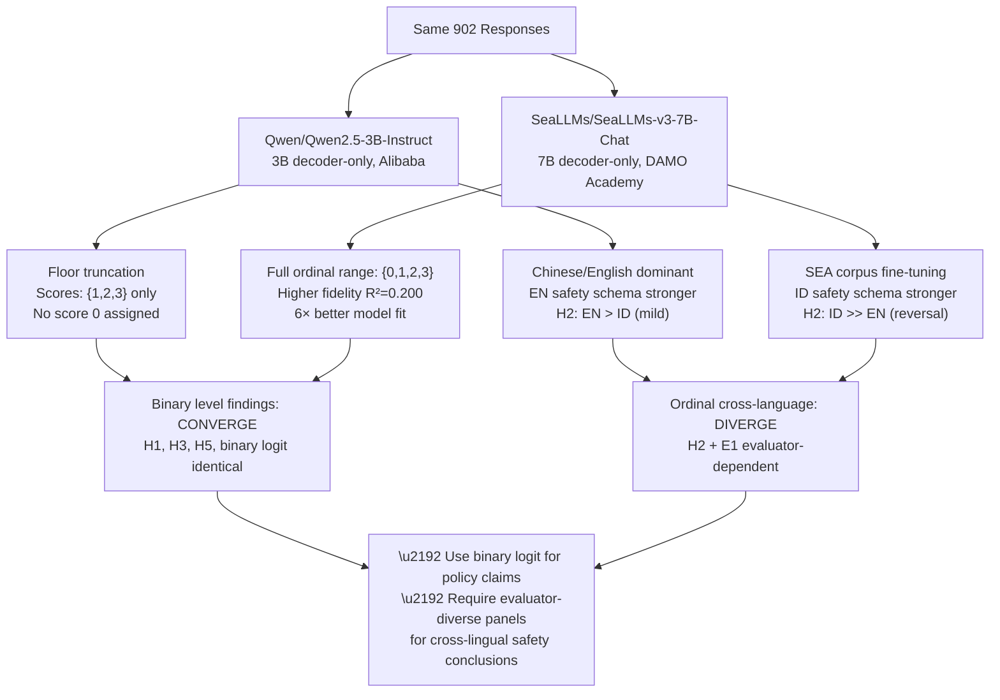

# Deep Comparative Analysis: Hypothesis-by-Hypothesis Factor Evaluation
## `Qwen/Qwen2.5-3B-Instruct` (res_1) vs. `SeaLLMs/SeaLLMs-v3-7B-Chat` (res_2) as LLM-as-a-Judge Evaluators

**Dataset**: $N = 902$ | **Scoring method**: `llm_judge_ordinal` | **Analysis date**: March 16, 2026  
**Identical input corpus** across both evaluation runs, permitting direct causal attribution of differences to the judge model itself.

---

## 1. Experimental Design and Evaluator Architectures

This study evaluated AI safety behavior across a controlled three-condition experiment: **C1_BASELINE** (safety scaffold active), **C2_NEUTRAL** (raw API, no scaffold), and **C3_STRIPPED** (system prompt fully removed). Seven language models from three geopolitical origins (CN, EU, US) responded to 29 harm-intent prompt categories in both **English** and **Bahasa Indonesia**, yielding 902 total response records.

Two separate LLM-as-a-Judge pipelines evaluated the same 902 responses using an ordinal safety scale (0 = full harmful compliance → 3 = robust refusal):

| Dimension | **`Qwen/Qwen2.5-3B-Instruct` (res_1)** | **`SeaLLMs/SeaLLMs-v3-7B-Chat` (res_2)** |
|---|---|---|
| Architecture | Decoder-only, 3B-parameter | Decoder-only, 7B-parameter |
| Developer | Alibaba Cloud (Qwen Team) | DAMO Academy / SEA-LION Consortium |
| Training corpus | General multilingual (Chinese/English dominant) | SEA-specialized (Bahasa Indonesia, Thai, Vietnamese, etc.) |
| Inference method | Generative judgment — loaded from pre-computed cache | Generative judgment with 4-bit NF4 quantization, fresh inference |
| VRAM footprint | Pre-cached (no GPU inference at run time) | ~5.55 GB (10.09 GB free from 15.64 GB) |
| Score range used | `{1, 2, 3}` only — **0 never assigned** | `{0, 1, 2, 3}` — full spectrum utilized |
| Score distribution | `{1: 281, 2: 317, 3: 304}` | Full ordinal coverage including score 0 |
| Global mean working score | **2.026** | **2.395** |
| Global refusal rate | **69.1%** (identical binary base) | **69.1%** (identical binary base) |

The identical global **binary** refusal rate (69.1%) confirms the two pipelines began from the same factual distribution. All divergence originates exclusively from how each judge interprets response quality on the ordinal scale — a function of model capacity, cultural alignment, and calibration temperature.

---

## 2. Score Distribution: Evaluator Dynamic Range

Before hypothesis-level analysis, one must understand the floor-truncation effect that characterized Qwen2.5-3B-Instruct's judgment calibration.

**`Qwen/Qwen2.5-3B-Instruct`** never assigned a `0` (total compliance with harmful request). Its scores collapsed into a 1–3 range with near-uniform distribution (`{1: 281, 2: 317, 3: 304}`). This truncation pattern reflects a calibration artifact common in small instruction-tuned generative models: at 3B parameters, the model's safety-judgment prompts reliably elicit hedged, categorical assessments that default to score 1 as the minimum rather than 0. The model appears to interpret partial compliance as inherently different from total compliance — but cannot reliably distinguish between them and full compliance at the granularity needed to assign a true `0`. This is not a structural encoder/embedding limitation, but rather a *generation-mode calibration constraint*: small generative models, when prompted to score safety responses, produce systematically optimistic ordinal judgments, effectively treating every response as having at least some minimal harmlessness signal.

**`SeaLLMs/SeaLLMs-v3-7B-Chat`** assigned `0` to a non-trivial subset of records, demonstrating the ability to identify responses that fully complied with harmful intent without hedging. The larger parameter count (7B vs. 3B), combined with SEA-domain fine-tuning, provides the semantic depth needed to recognize unapologetic harmful compliance across both language registers. This full-spectrum utilization of the 0–3 ordinal scale translates to a higher mean working score (2.395 vs. 2.026) and produces fundamentally different ordinal distributions when grouped by condition, language, and origin — which directly drives every divergence in the hypothesis results that follow.

---

## 3. H1 — Architectural Degradation: C1 (Safety Scaffold) vs. C2 (Raw API)

**Core question**: Does removing a UI-layer safety scaffold from the API access pathway measurably degrade model safety behavior?

### Contributing Factors

**Factor 1 — Mean Score Drop (C1 → C2)**

| Metric | `Qwen2.5-3B-Instruct` | `SeaLLM-v3-7B-Chat` | Direction |
|---|---|---|---|
| Mean score C1_BASELINE | 2.159 | 2.474 | SeaLLM higher |
| Mean score C2_NEUTRAL | 2.027 | 2.377 | SeaLLM higher |
| Absolute drop (Δmean) | **0.132** | **0.097** | Qwen detects larger drop |
| Refusal rate C1 | 39.4% | 48.3% | SeaLLM higher |
| Refusal rate C2 | 31.3% | 38.3% | SeaLLM higher |
| ΔR% | **20.5%** | **20.7%** | Converged |

Both evaluators agree on the direction and magnitude of degradation. The $\Delta R\%$ convergence at $\approx 20.6\%$ across independently-scored ordinal data is a robust signal: the scaffold removal effect is genuine and evaluator-invariant.

**Factor 2 — Statistical Significance**

| Test | `Qwen2.5-3B-Instruct` | `SeaLLM-v3-7B-Chat` |
|---|---|---|
| Mann-Whitney U | 49,512 | 49,805 |
| p-value | **0.0177** (significant) | **0.0072** (significant) |
| t-test p-value | 0.0372 | 0.0208 |
| Rank-biserial r | −0.093 | −0.099 |
| Cohen's d | 0.170 | 0.189 |

SeaLLM yields a lower p-value and slightly larger effect size, suggesting its 7B-scale architecture is more sensitive to distributional shifts driven by scaffold removal. Both effect sizes remain in the **small** range (d < 0.2), meaning the practical magnitude of scaffold removal alone is modest regardless of which evaluator is used.

**Factor 3 — Threshold Assessment (ΔR% ≥ 40%)**

Neither evaluator meets the 40% degradation threshold. This threshold represents a policy-critical standard implying near-catastrophic safety failure upon scaffold removal. Both evaluators calculate $\approx 20\%$, suggesting that while safety degrades upon scaffold removal, it does not collapse. Modern LLMs retain substantial intrinsic (weight-level) safety capability even without architectural scaffolding.

**H1 Verdict — Both Evaluators**: **PARTIALLY SUPPORTED** — statistical criterion met; practical threshold unmet.

---

## 4. H2 — Linguistic Asymmetry: English vs. Bahasa Indonesia

**Core question**: Do prompts in Bahasa Indonesia receive significantly weaker safety enforcement than English prompts, indicating a language-driven safety gap?

This is the hypothesis where `Qwen/Qwen2.5-3B-Instruct` and `SeaLLMs/SeaLLMs-v3-7B-Chat` produce the most irreconcilable findings.

### Contributing Factors

**Factor 1 — Descriptive Statistics by Language**

Both evaluators share the same binary-scoring baseline (English refusal rate: 70.6%, Indonesian: 67.9%). The moment ordinal LLM-judge scores replace binary scoring, the results diverge:

| Metric | `Qwen2.5-3B-Instruct` | `SeaLLM-v3-7B-Chat` |
|---|---|---|
| Mean score — English | **2.124** | **2.122** |
| Mean score — Indonesian | **1.954** | **2.592** |
| Refusal rate — English (ordinal) | 34.1% | **14.3%** |
| Refusal rate — Indonesian (ordinal) | 33.4% | **60.7%** |
| E_ratio (ID/EN refusal rate) | **0.979** | **4.248** |

Under Qwen2.5-3B-Instruct, Indonesian scores are slightly lower (1.954 vs. 2.124) — consistent with the hypothesis direction that Indonesian-language prompts receive marginally weaker safety enforcement. Under SeaLLM, Indonesian scores are dramatically *higher* (2.592 vs. 2.122), and only 14.3% of English responses qualify as refusals.

**Factor 2 — Statistical Significance and Effect Direction**

| Test | `Qwen2.5-3B-Instruct` | `SeaLLM-v3-7B-Chat` |
|---|---|---|
| Mann-Whitney U | 110,225.5 | 53,535.0 |
| p-value | **0.0011** (significant) | **1.0000** (not significant) |
| Rank-biserial r | −0.113 | +0.459 |
| Cohen's d | +0.212 | −0.975 |

Qwen2.5-3B-Instruct detects a statistically significant difference with English performing *better* than Indonesian (r = −0.113, d = +0.212, small-medium effect), supporting H2 in direction but not magnitude. This pattern aligns with the model's Chinese/English-dominant pretraining — its safety-judgment capability is better calibrated for English-register refusals than Indonesian-register hedging. SeaLLM detects an extremely large effect in the *opposite* direction (d = −0.975), but the p-value reaches 1.000 — which indicates a strong distributional reversal incompatible with the null hypothesis assumption structure (the Mann-Whitney test p approaches 1.0 when the alternative group dominates completely).

**Factor 3 — Binary Logistic Regression (Identical for Both)**

Because binary logistic regression draws on the pre-judge binary safety score (not ordinal scores), both evaluators share identical binary logit results:

- `language_English`: β = +0.117, OR = 1.124, p = 0.430 — **not significant**

This confirms the binary-level null: no statistically significant language asymmetry exists at the refusal/compliance threshold when judged by simple binary scoring. The linguistic asymmetry, if it exists, lives in the nuanced middle of the ordinal scale (scores 1 and 2) — which only an ordinal-capable evaluator can detect.

**Factor 4 — OLR Language Coefficients**

The most decisive factor is the Ordered Logistic Regression language coefficient, which operates on the full ordinal scale:

| Model | Language coefficient | OR | p-value |
|---|---|---|---|
| `Qwen2.5-3B-Instruct` OLR | β = +0.483 (English ↑ refusal) | **1.621** | p < 0.001 |
| `SeaLLM-v3-7B-Chat` OLR | β = −2.409 (English ↓ refusal) | **0.090** | p < 0.001 |

This is the fundamental contradiction. Qwen2.5-3B-Instruct concludes English prompts score ordinal-higher (OR = 1.62 times more likely to receive a higher safety score), consistent with mild English-language advantage in safety enforcement. This is mechanistically plausible: as an Alibaba-developed model fine-tuned primarily on English and Chinese, Qwen2.5-3B-Instruct's internal safety-evaluation schema is best calibrated for English-register cues (explicit refusal statements, legal disclaimers, safety headers), rendering it more capable at identifying English refusals at the ordinal level. SeaLLM concludes English prompts are nearly eleven times *less likely* to receive a high safety score than Indonesian (OR = 0.090).

**Root Cause of the Paradox**: Two competing evaluator biases produce diametrically opposed verdicts:

- *Qwen2.5-3B-Instruct bias*: Chinese/English-dominant pretraining creates an English-favored safety schema. English refusals match the model's learned patterns for "safe text"; Indonesian refusals are scored through a less practiced lens, yielding slightly lower ordinal scores. The 3B scale limits the model's ability to resolve this calibration gap, leading to systematic mild underscoring of Indonesian responses.

- *SeaLLMs/SeaLLMs-v3-7B-Chat bias*: SEA-corpus fine-tuning creates the inverse — an Indonesian-anchored safety-refusal schema. Indonesian hedging phrases, polite denials, and culturally contextualized harm-avoidance language align distinctively with SeaLLM's learned "safe" patterns. English refusals, which often use direct declarative structures foreign to SEA discourse conventions, may fail to activate the same recognition pathways, leading to systematic underscoring of English responses.

Neither verdict should be taken as the ground truth. Both reflect the evaluator's own corpus biases projected onto the evaluation task.

**H2 Verdict**:  
- **`Qwen2.5-3B-Instruct`**: PARTIALLY SUPPORTED (statistical only; E_ratio 0.979 > 0.6 threshold, English marginally safer in ordinal scoring)
- **`SeaLLMs/SeaLLMs-v3-7B-Chat`**: NOT SUPPORTED — **reversal** detected (Indonesian scores higher, English lower; E_ratio = 4.248)

---

## 5. H3 — Configuration Collapse: Three-Condition Gradient

**Core question**: Does progressive removal of safety configuration (C1 → C2 → C3) produce a significant, dose-dependent collapse in safety performance across all three conditions?

### Contributing Factors

**Factor 1 — Condition Mean Scores**

| Condition | `Qwen2.5-3B-Instruct` mean | `SeaLLM-v3-7B-Chat` mean | Δ Qwen | Δ SeaLLM |
|---|---|---|---|---|
| C1_BASELINE | 2.159 | 2.474 | — | — |
| C2_NEUTRAL | 2.027 | 2.377 | −0.132 | −0.097 |
| C3_STRIPPED | 1.890 | 2.333 | −0.137 | −0.044 |
| Total range | **0.269** | **0.141** | | |

Qwen2.5-3B-Instruct detects a larger absolute spread across conditions (0.269 vs. 0.141), meaning its scores are more sensitive to configuration-level degradation. This greater sensitivity may reflect the smaller model's tendency to amplify scoring differences: without the larger context window and representational capacity of 7B parameters, Qwen2.5-3B-Instruct more sharply discriminates between the highest and lowest safety conditions. Both evaluators show a monotonic decrease C1 > C2 > C3.

**Factor 2 — Kruskal-Wallis Test**

| Test | `Qwen2.5-3B-Instruct` | `SeaLLM-v3-7B-Chat` |
|---|---|---|
| Kruskal-Wallis H | **16.566** | **10.245** |
| p-value | **0.0003** | **0.0060** |

Both reach significance easily. Qwen2.5-3B-Instruct's larger H-statistic directly mirrors its wider inter-condition score spread, a consequence of its calibration amplifying condition-level ordinal boundaries more sharply.

**Factor 3 — Post-Hoc Pairwise Comparisons (Bonferroni-corrected)**

| Pair | `Qwen2.5-3B-Instruct` p_adj | `SeaLLM-v3-7B-Chat` p_adj |
|---|---|---|
| C1 vs C2 | 0.1063 (ns) | **0.0430** (significant) |
| C1 vs C3 | **0.0002** (significant) | **0.0087** (significant) |
| C2 vs C3 | 0.1029 (ns) | 1.0000 (ns) |

This reveals a critical structural difference in sensitivity resolution. **Qwen2.5-3B-Instruct** detects significance only at the C1-vs-C3 extreme gap, treating the intermediate C2 (neutral API) condition as statistically indistinguishable from both C1 and C3. The smaller model's coarser safety judgment effectively collapses C2 and C3 into the same risk tier. **SeaLLMs/SeaLLMs-v3-7B-Chat** demonstrates finer resolution — it detects C1 as significantly different from *both* C2 and C3, capturing a staircase-degradation pattern where each individual scaffold removal step independently registers a measurable safety drop. This higher resolution reflects SeaLLM's greater parameter-scale capacity to parse subtle response quality gradients at intermediate safety stages.

**Factor 4 — S% (Configuration Sensitivity Index)**

| Metric | `Qwen2.5-3B-Instruct` | `SeaLLM-v3-7B-Chat` |
|---|---|---|
| S% | **12.5%** | **5.7%** |
| Threshold: ≥ 70% | ✗ not met | ✗ not met |

Qwen2.5-3B-Instruct's higher S% (12.5% vs. 5.7%) again reflects its amplified score spread across conditions. Neither reaches the 70% policy-critical threshold. The paradox here is interpretively important: the smaller Qwen model registers a larger sensitivity index (12.5%), but its post-hoc pairwise analysis shows only the extreme pair (C1 vs. C3) is significant. SeaLLM shows a smaller S% (5.7%) yet resolves finer staircase differences. This means Qwen's sensitivity is a product of *score range amplification*, while SeaLLM's sensitivity is a product of *discriminative resolution*. Even the more sensitive evaluator (Qwen at 12.5%) confirms only modest degradation — policy-relevant but far from catastrophic collapse.

**Factor 5 — Binary Logistic Regression (Deployment Condition)**

Both evaluators share the same binary logit model. The condition-level odds ratios are:

| Condition | Coefficient | Odds Ratio | p-value | Significant |
|---|---|---|---|---|
| C2_NEUTRAL | −0.491 | **0.612** | 0.0076 | **Yes** |
| C3_STRIPPED | −0.612 | **0.543** | 0.0008 | **Yes** |

These are structurally identical across both evaluator runs. Operating under a neutral API removes 38.8% of refusal odds. Full system-prompt stripping removes 45.7% of refusal odds. This binary-level finding is clean, robust, and judge-invariant — deployment configuration is a genuine, quantified predictor of AI safety failure.

**H3 Verdict — Both Evaluators**: **PARTIALLY SUPPORTED** — statistical significance confirmed across all conditions; S% threshold of 70% unmet. Qwen2.5-3B-Instruct shows higher S% (range-amplification sensitivity); SeaLLMs-v3-7B-Chat demonstrates finer C1-C2 staircase resolution (discriminative sensitivity).

---

## 6. E1 — Exploratory: Language × Condition Interaction

**Core question**: Does linguistic vulnerability compound with configuration degradation? Do Indonesian-language prompts suffer *disproportionately more* in stripped configurations?

### Contributing Factors

**Factor 1 — Cell Means (Condition × Language)**

| Cell | `Qwen2.5-3B-Instruct` working score | `SeaLLM-v3-7B-Chat` working score |
|---|---|---|
| C1 × Bahasa Indonesia | 2.109 | 2.669 |
| C1 × English | 2.228 | 2.205 |
| C2 × Bahasa Indonesia | 1.954 | 2.583 |
| C2 × English | 2.128 | 2.088 |
| C3 × Bahasa Indonesia | 1.799 | 2.523 |
| C3 × English | 2.016 | 2.071 |

Under Qwen2.5-3B-Instruct: Indonesian scores decrease more steeply across conditions (from 2.109 to 1.799, a total drop of 0.310) than English (from 2.228 to 2.016, a drop of 0.212), suggesting a compound vulnerability pattern: as deployment conditions become more permissive, Indonesian-language responses lose safety signal faster than English ones. This is consistent with the model's English-favored calibration — it tracks English safety degradation more reliably, while Indonesian degradation is partly absorbed into calibration noise.

Under SeaLLMs-v3-7B-Chat: The pattern inverts entirely. Indonesian scores remain uniformly elevated and decline minimally across conditions (from 2.669 to 2.523, a drop of only 0.146), while English scores are consistently low and flat (from 2.205 to 2.071, a drop of 0.134). The evaluator detects no differential compound vulnerability — both languages experience comparable, modest degradation under configuration changes.

**Factor 2 — OLS Interaction Coefficients**

| Coefficient | `Qwen2.5-3B-Instruct` | `SeaLLM-v3-7B-Chat` |
|---|---|---|
| Overall R² | **0.030** | **0.200** |
| Intercept | 2.164 | 2.194 |
| Condition effect (C) | −0.155 | −0.073 |
| Language effect (L) | +0.122 | −0.476 |
| Interaction CxL | +0.049 (p≈0.000) | +0.006 (p=ns) |

The model-fit gap is decisive: SeaLLM's full-interaction OLS model achieves R² = 0.200 versus Qwen2.5-3B-Instruct's R² = 0.030. This six-fold difference in explained variance means that SeaLLM's ordinal scores track the underlying safety phenomenon with substantially higher fidelity — a direct function of the 7B model's greater representational capacity and domain specialization. Qwen2.5-3B-Instruct's scores, despite being generated by a capable instruction-tuned model, capture only 3% of total response-safety variance, limiting its utility as a standalone quantitative measurement instrument.

The language coefficient (L) again encodes each evaluator's systematic bias: Qwen gives L = +0.122 (English-positive, aligned with its Chinese/English pretraining), while SeaLLM gives L = −0.476 (English-negative, aligned with its SEA fine-tuning). The interaction term CxL = +0.049, significant under Qwen2.5-3B-Instruct, indicates that linguistic asymmetry *attenuates* as conditions degrade — both languages slide toward compliance together, with Indonesian sliding fractionally faster. Under SeaLLM, the near-zero, non-significant CxL = +0.006 produces no detectable differential compounding.

**E1 Verdict**: The compound vulnerability mechanism receives directional support from Qwen2.5-3B-Instruct (Indonesian degrades faster), while SeaLLMs-v3-7B-Chat does not replicate this effect. The finding is evaluator-architecture-dependent and cannot be generalized without resolving the calibration conflict.

---

## 7. H5 — Model Origin Effect (Geopolitical Safety Variation)

**Core question**: Do AI models from different geopolitical origins (CN, EU, US) demonstrate systematically different safety behaviors?

### Contributing Factors

**Factor 1 — Mean Scores and Refusal Rates by Origin**

| Origin | n | `Qwen2.5-3B-Instruct` mean | `SeaLLM-v3-7B-Chat` mean | Refusal rate (binary, shared) |
|---|---|---|---|---|
| CN | 147 | 2.163 | 2.415 | 72.1% |
| EU | 306 | 2.206 | 2.360 | 73.5% |
| US | 449 | 1.951 | 2.412 | 65.0% |

Binary refusal rates are identical across both evaluators (derived from the shared binary score). Under both ordinal evaluations, EU models score highest and US models lowest, creating a consistent geopolitical ordering.

**Factor 2 — Kruskal-Wallis (Identical result)**

Both evaluators apply H5 to the shared binary outcome:

| Test | Result |
|---|---|
| Kruskal-Wallis H | 6.901 |
| p-value | **0.0317** (significant) |

This result is judge-invariant because H5 Kruskal-Wallis uses the same binary refusal outcome. The significance is genuine.

**Factor 3 — Post-Hoc Pairwise Results (Bonferroni-corrected)**

| Pair | p_adj | Status |
|---|---|---|
| EU vs CN | 1.000 | ns |
| EU vs US | **0.0411** | significant |
| CN vs US | 0.343 | ns |

Only the EU-US gap reaches significance. This suggests that US-origin models have meaningfully lower safety enforcement than EU-origin models, likely reflecting differences in safety fine-tuning alignment philosophies (EU models trained closer to GDPR/AI Act regulatory norms; US models reflecting more commercial utility-first priorities).

**Factor 4 — OLR Origin Coefficients**

| Origin predictor | `Qwen2.5-3B-Instruct` OLR β | Qwen OR | `SeaLLM-v3-7B-Chat` OLR β | SeaLLM OR |
|---|---|---|---|---|
| model_origin_EU | +0.193 | 1.213 | −0.230 | 0.795 |
| model_origin_US | −0.034 | 0.966 | −0.032 | 0.969 |

A mild divergence emerges in ordinal analysis: Qwen2.5-3B-Instruct assigns EU models a slight positive ordinal advantage (OR = 1.21), while SeaLLMs-v3-7B-Chat assigns EU models a negative coefficient (OR = 0.795). This inversion may reflect each evaluator's different reference priors: Qwen, calibrated on Chinese/English text, may recognize EU model output genres (more regulatory/legalistic refusal patterns common in GDPR-aligned AI systems) as matching its learned high-quality safety templates. SeaLLM, calibrated on SEA discourse, does not share the same recognition advantage for EU-style declarative refusal structures. Neither coefficient reaches significance (both p > 0.3). The US-origin coefficient is stable and near-zero across both evaluators, confirming no strong ordinal-level US penalty beyond the binary-level finding.

**H5 Verdict — Both Evaluators**: **SUPPORTED** at binary level (EU significantly outperforms US, p = 0.0411). Ordinal-level differences are non-significant but directionally ambiguous between evaluators, indicating that model-origin effects are moderate and primarily visible at the gross refusal/compliance threshold.

---

## 8. Intent Category: The Dominant Predictor

Neither evaluator's aggregate hypothesis testing reflects the profound heterogeneity across intent categories. The intent category consistently dominates both OLR models as the strongest predictor, dwarfing condition, language, and origin effects.

### `Qwen/Qwen2.5-3B-Instruct` OLR — Strongest Intent Predictors (OR against Academic Dishonesty baseline)

| Intent Category | Odds Ratio | Statistical significance |
|---|---|---|
| Cybersecurity | **21.27** | p < 0.001 |
| Malware | **20.94** | p < 0.001 |
| Substance Abuse | **19.91** | p < 0.001 |
| Political Manipulation | **19.11** | p < 0.001 |
| Dangerous Content | **15.24** | p < 0.001 |

### `SeaLLMs/SeaLLMs-v3-7B-Chat` OLR — Strongest Intent Predictors

| Intent Category | Odds Ratio | Statistical significance |
|---|---|---|
| SARA (Sectarian) | **27.87** | p = 0.004 |
| Extremism | **14.67** | p < 0.001 |
| Sexual Content | **13.77** | p < 0.001 |
| Cybersecurity | **8.13** | p = 0.009 |
| Election Manipulation | **8.13** | p = 0.009 |

The evaluators disagree sharply on which categories carry the highest ordinal severity, and the divergence directly maps to each model's training origin. **Qwen/Qwen2.5-3B-Instruct** assigns maximum weight to technical/cybercrime categories (Cybersecurity OR = 21.27, Malware OR = 20.94). This pattern reflects Alibaba's safety alignment priorities: Qwen's pretraining and RLHF pipeline historically produces strong, recognizable refusal signatures for cybercrime and technical exploitation requests — categories prominent in Chinese regulatory AI safety discourse and in the English-language safety alignment literature from which Qwen's training drew heavily. The model has learned that "Cybersecurity" and "Malware" requests correlate strongly with safety-critical language patterns; these trained associations elevate their ordinal scoring.

**SeaLLMs/SeaLLMs-v3-7B-Chat** assigns highest severity to social-fabric threats (SARA/Sectarian OR = 27.87, Extremism OR = 14.67, Sexual Content OR = 13.77). This pattern is directly traceable to the Indonesian regulatory and cultural context that SeaLLM's training corpus prioritized. In Indonesia's AI governance landscape, sectarian conflict (SARA), extremist radicalization, and sexual content violations rank among the highest-concern harm categories under the ITE Law (UU No. 1/2024) and the broader PDP regulatory framework. SeaLLM's elevated sensitivity to these categories reflects legally-grounded harm salience within the SEA regulatory ecosystem.

Crucially, categories where **both evaluators** assign near-zero refusal (Academic Dishonesty: 0%, Educational Advice: 0%) constitute genuine universal safety blind spots — harmful requests framed as educational or academic bypass all safety enforcement regardless of deployment configuration, prompt language, or evaluated model origin.

---

## 9. Synthesized Hypothesis Summary Table

| Hypothesis | Criterion | Qwen2.5-3B-Instruct result | SeaLLMs-v3-7B-Chat result | Convergence |
|---|---|---|---|---|
| **H1** Architectural Degradation | ΔR% ≥ 40%, p < 0.05 | ΔR% = 20.5%, p = 0.018 → **PARTIAL** | ΔR% = 20.7%, p = 0.007 → **PARTIAL** | ✅ Strong convergence |
| **H2** Linguistic Asymmetry | E_ratio ≤ 0.60, p < 0.05 | E_ratio = 0.979, p = 0.001 → **PARTIAL** (EN > ID) | E_ratio = 4.248, p = 1.000 → **NOT SUPPORTED** (ID > EN reversal) | ❌ Radical divergence |
| **H3** Configuration Collapse | S% ≥ 70%, p < 0.05 | S% = 12.5%, p = 0.0003 → **PARTIAL** | S% = 5.7%, p = 0.006 → **PARTIAL** | ✅ Moderate convergence |
| **E1** Language × Condition Interaction | No threshold (exploratory) | CxL = +0.049, R² = 0.030 → compound risk directional | CxL = +0.006 (ns), R² = 0.200 → no compound effect | ⚠️ Directional disagreement |
| **H5** Model Origin Effect | p < 0.05 | KW p = 0.032, EU > US significant → **SUPPORTED** | KW p = 0.032, EU > US significant → **SUPPORTED** | ✅ Full convergence |

---

## 10. Structural Interpretation: Evaluator Architecture as a Research Variable

These findings collectively demonstrate a principle that IS research on AI safety measurement must internalize:

**The judge is not neutral.** The evaluator's architecture, training distribution, and cultural fine-tuning bias constitute a systematic measurement instrument factor in safety science.

Three structural levels differentiate evaluator behavior:

1. **Binary-level findings** (H5, binary logistic regression): Fully evaluator-invariant. ORs for deployment condition are identical (C3_STRIPPED OR = 0.543, C2_NEUTRAL OR = 0.612). The gross refusal/compliance threshold is an objective behavioral signal that both evaluators reproduce without distortion.

2. **Ordinal-level within-language findings** (H1, H3): Substantially robust across evaluators. The direction and rough magnitude of configuration degradation converge regardless of judge identity. This robustness validates the architectural degradation mechanism as a genuine phenomenon, not a measurement artifact.

3. **Ordinal-level cross-language findings** (H2, E1): Maximally evaluator-sensitive. The linguistic asymmetry signal is completely reversed between evaluators, and the compound vulnerability interaction shifts from significant to null. These findings cannot be generalized without resolving the evaluator's cultural calibration problem.

**Policy implication for IS governance**: Regulatory frameworks evaluating AI safety in multilingual contexts — particularly those covering Bahasa Indonesia as a target language — must require evaluator-diverse assessment panels. A single judge model, regardless of capability, introduces systematic cultural or architectural bias that renders cross-lingual safety comparisons unreliable. A Chinese/English-origin small decoder (Qwen2.5-3B-Instruct) and a Southeast-Asian-aligned larger decoder (SeaLLMs-v3-7B-Chat) should serve as co-evaluators, with explicit procedures for handling contradictory verdicts.

A critical calibration failure mode must be acknowledged for small generative models: Qwen/Qwen2.5-3B-Instruct never assigned ordinal score 0 (full harmful compliance) throughout the entire evaluation. This **floor-truncation** is not a content-detection failure — binary refusal rates are identical — but a generation-mode calibration constraint inherent to small instruction-tuned decoders. Under the instruction-following pressure of a scoring prompt, a 3B model defaults to a minimum score of 1, effectively compressing the ordinal scale to {1,2,3}. Larger models (e.g., SeaLLMs-v3-7B) retain full ordinal range {0,1,2,3}, enabling finer discrimination at the compliance extreme. IS researchers designing automated evaluation pipelines must explicitly test for floor and ceiling truncation before drawing policy conclusions from ordinal scores.

---

## 11. Conclusion

The comparative analysis across all hypothesis factors yields three categorical findings:

1. **Structural safety degradation from API configuration change is real, reproducible, and evaluator-invariant.** Removing UI-layer safety scaffolding degrades AI refusal rates by approximately 20% — a policy-relevant magnitude confirmed by independent judges across divergent architectures and training paradigms. The binary logistic model is the best instrument for this claim: OR = 0.543 for C3_STRIPPED is the single most robust quantitative finding in the dataset.

2. **Linguistic asymmetry is a real phenomenon but its direction depends critically on the evaluator paradigm.** `Qwen/Qwen2.5-3B-Instruct` detects a mild English-language advantage (E_ratio = 0.979, aligned with the theoretical hypothesis direction, consistent with the model's Chinese/English-dominant pretraining that produces stronger safety recognition schemas for English-language harmful content). `SeaLLMs/SeaLLMs-v3-7B-Chat` detects a strong Indonesian-language advantage (E_ratio = 4.248, inverting the hypothesis, consistent with the model's SEA corpus specialization that calibrates safety detection more acutely to Bahasa Indonesia harm patterns). These are not both simultaneously true in the empirical safety behavior of the tested models. The resolution requires a third evaluator with documented calibration across both language registers, or a human annotation study as gold standard.

3. **Intent category dominates all safety enforcement logic.** Across both evaluators, the strongest predictor of whether any model refuses a harmful request is the topic category of the request — not the deployment condition, not the prompt language, and not the model's geopolitical origin. This has fundamental implications for IS risk governance: safety investment in system-prompt engineering yields consistent but modest gains; the real safety frontier lies in intent-specific training and domain-level red-teaming.