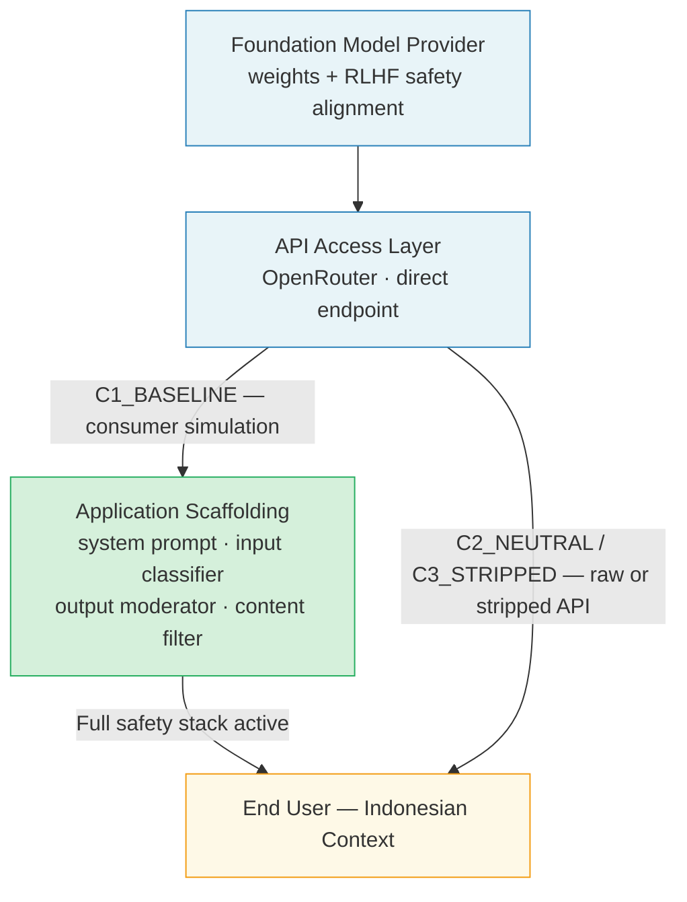
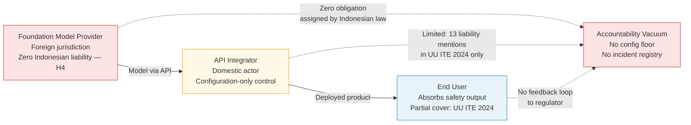

# Chapter 1: Introduction

## 1.1 The Indonesian AI Deployment Paradox

Indonesia occupies a structurally paradoxical position in the global AI landscape. The country's *Strategi Nasional Kecerdasan Artifisial 2020–2045* (Stranas KA) projects AI as the primary engine of Indonesia's transition toward a digital economy, targeting AI-driven productivity gains across healthcare, finance, public administration, and educational sectors [9]. Yet the dominant mode through which Indonesian organizations access AI capability is neither domestic model development nor vertically integrated deployment: it is API mediation — routing user interactions through global foundation models via commercial interfaces such as OpenRouter, direct model provider APIs, and third-party integration platforms. Indonesian startups embed GPT-4, LLaMA, Gemma, and Qwen into consumer-facing applications via API calls; government agencies deploy AI-powered document processing through API-connected pipelines; healthcare platforms route symptom queries through model endpoints. In every case, the safety properties of the deployed AI system depend critically not on regulatory compliance requirements, but on the configuration choices of the domestic API integrator.

*Figure 1.1: Three-layer AI deployment architecture. C1\_BASELINE preserves all safety layers; C2/C3 API deployment bypasses the application scaffolding layer, exposing foundation model safety properties without mediating controls. Safety outcome dependency shifts entirely to deployer configuration choices at the API layer.*

This configuration dependency represents the core vulnerability that this research empirically characterizes and theoretically frames. Foundation model providers invest substantial resources in safety alignment — Reinforcement Learning from Human Feedback [25], Constitutional AI [26], and extensive red-teaming [17] produce baseline safety behaviors embedded in model weights. These weight-level safety properties, however, exist within a three-layer deployment architecture: the foundation model layer (provider-controlled), the API access layer (accessible to any authenticated developer), and the application scaffolding layer (entirely integrator-controlled). Transitioning from vertically integrated consumer deployment — where all three layers operate under the provider's safety orchestration — to raw API deployment removes the application scaffolding layer entirely. The safety consequence of this removal has not been quantified for the Indonesian deployment context.

## 1.2 The Information Systems Governance Problem

Information Systems research has established that socio-technical systems involve not only technological components but the institutional structures, governance frameworks, and human actors that configure, deploy, and maintain those components [7]. In the AI-as-a-service paradigm, the IS governance problem is structurally distinct from prior generations of IT governance: the entity that trains and owns the model (the Foundation Model Provider) is jurisdictionally separated from the entity that configures its deployment (the API integrator), who is in turn separated from the entity that absorbs potential harm (the end user). This three-actor chain — provider, deployer, user — creates what Hollnagel [7] would recognize as a distributed accountability structure in which each actor can characterize safety as the responsibility of another.

Indonesia's regulatory corpus does not address this chain. Eight regulatory instruments govern adjacent domains — data protection (UU PDP No. 27/2022 [10]), electronic information (UU ITE No. 1/2024 [11]), financial technology (POJK 13/2018 [12], POJK 23/2019 [13]), medical records and telemedicine (Permenkes 24/2022 [14]), government digital services (PermenPANRB 5/2020 [15]), and AI strategy (Stranas KA [9]) — yet none assigns explicit safety obligations to the API deployer role. Foundation Model Provider liability achieves zero mentions across all eight instruments, as this study's regulatory analysis demonstrates. The gap between Indonesia's AI adoption ambition and its governance infrastructure constitutes a structural policy failure with measurable safety consequences for Indonesian users.

*Figure 1.2: Three-actor accountability chain in Indonesian API-mediated AI deployment. The Foundation Model Provider (highest design capacity) carries zero Indonesian regulatory obligation; the API Integrator (configuration-only control) carries limited obligation under UU ITE; the End User absorbs safety harms with no clear regulatory recourse. Dashed edges denote regulatory accountability; solid edges denote technical dependency.*

## 1.3 Research Motivation and Contribution

Prior empirical work on LLM safety evaluation operates primarily in English-language, Western-regulatory contexts [1][3][4][17][18]. The sparse existing literature on cross-lingual safety degradation documents pronounced performance asymmetries for low-resource languages relative to English, including Indonesian [5][6][33]. However, these studies do not isolate the API deployment layer as the independent variable of interest, nor do they pair safety measurement with regulatory gap analysis in a single study. This research addresses three simultaneous gaps in the literature:

1. **Empirical gap**: No study has directly measured how safety properties of the same foundation models change as a function of API configuration in the Indonesian context, across both languages and multiple model origins.
2. **Methodological gap**: Binary keyword-based safety evaluation — common in prior studies — collapses the critical distinction between robust refusal and partial guardrail, precisely the cases most relevant to API deployment risk. This study operationalizes ordinal safety scoring through a dual LLM-as-a-Judge architecture.
3. **Governance gap**: No study has mapped Indonesian AI regulatory coverage to API deployment-specific safety obligations using dual-model semantic analysis, nor linked regulatory findings to empirical safety measurements in a unified analytical framework.

The research delivers four contributions at the intersection of technical AI safety, multilingual evaluation methodology, and IS governance:

- **The first quantitative measurement** of API safety asymmetry across three deployment conditions and two languages in the Indonesian context (n=902 interactions, seven foundation models);
- **A replicable dual LLM-as-a-Judge evaluation methodology** using open-access infrastructure, validated through architecturally distinct primary (Qwen2.5-3B) and cross-validation (SeaLLMs-v3-7B) judges;
- **A dual-model semantic regulatory gap matrix** mapping 31 AI safety concepts against eight Indonesian governance instruments via independent transformer evaluators (MiniLM-L12-v2 and E5-base), with evaluator-invariance as the validation criterion;
- **Evidence-based policy analysis** identifying Foundation Model Provider liability as an absolute legislative absence and two sectoral domains — medical AI and tax/legal AI — as carrying critical regulatory gaps with no inference-layer safety obligations.

## 1.4 Research Questions

This study addresses one primary and six operational sub-questions:

**Primary Research Question:** What is the measurable magnitude and qualitative character of AI safety degradation when global foundation models are deployed via API in Indonesia, and how do Indonesia's current regulatory instruments address or fail to address these asymmetries?

The operational sub-questions operationalize this primary question across five empirically testable hypotheses and two analytical tracks:

- **RQ1 (H1):** What is the safety differential between consumer-simulated and raw API deployment?
- **RQ2 (H2):** How does cross-language performance differ between English and Bahasa Indonesia prompts?
- **RQ3 (H3):** How sensitive are safety guardrails to implementer configuration choices across the C1→C2→C3 spectrum?
- **RQ4 (H4):** What is the API safety coverage density in Indonesian regulatory instruments, and do sectoral regulations assign any obligation to the API deployer role?
- **RQ5 (H5):** How does model geographic origin modulate safety asymmetry patterns?
- **RQ6:** What is the semantic coverage gap for API-specific AI safety across Indonesia's full corpus of eight regulatory instruments?
- **RQ7:** What observable evidence of API-mediated AI deployment exists in Indonesia's digital ecosystem, and what documented incidents substantiate real-world safety failures?

## 1.5 Scope and Boundaries

This study restricts its analysis to text-based foundation model outputs generated via API, utilizing free-tier infrastructure (OpenRouter) to ensure accessibility and reproducibility for resource-constrained researchers. The regulatory analysis covers eight national and sectoral instruments; local government (*Perda*) provisions and inter-ministerial circulars fall outside the scope. Three deployment conditions represent theoretical extremes of integrator configuration; actual production configurations vary continuously. The quantitative primary design characterizes observable behavioral patterns but does not capture organizational or cultural determinants of safety implementation, which require separate qualitative investigation.

## 1.6 Paper Organization

Section 2 reviews the theoretical foundations and empirical precedents across AI safety measurement, multilingual evaluation, foundation model governance, and regulatory gap theory. Section 3 develops the theoretical framework, introducing the *API-Mediated AI Safety Asymmetry* construct and its four analytical dimensions. Section 4 details the methodology, covering the testing protocol, prompt battery design, dual LLM-as-a-Judge evaluation architecture, statistical analysis plan, and regulatory corpus analysis protocol. Section 5 reports results by hypothesis. Section 6 discusses findings in relation to theory and policy. Section 7 concludes with contributions, limitations, and future research directions.
