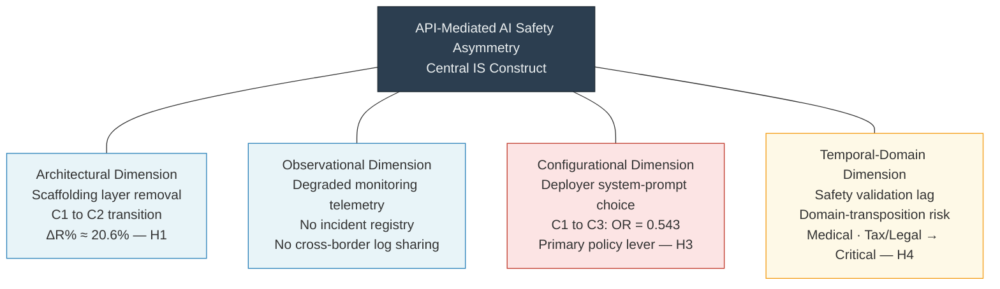
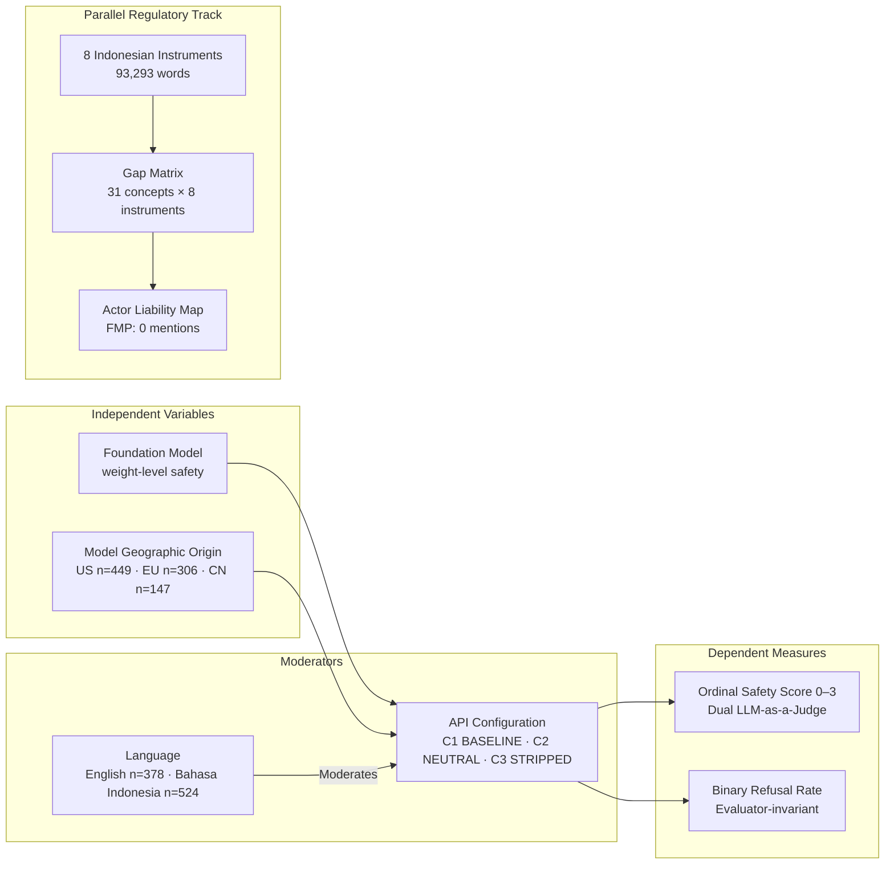

# Chapter 3: Theoretical Framework

## 3.1 The Central Construct: API-Mediated AI Safety Asymmetry

This study proposes and operationalizes a theoretical construct termed **API-Mediated AI Safety Asymmetry** — the systematic degradation of safety capabilities that occurs when a foundation model transitions from vertically integrated consumer deployment to horizontally distributed API deployment, observable across four technical dimensions and exacerbated by Indonesia's specific linguistic and regulatory environment.

The construct synthesizes two theoretical traditions: Technical Safety Measurement Theory [1][3] and Regulatory Gap Theory [2][8]. Technical Safety Measurement Theory provides the operationalization logic — safety is measurable as observable output properties (refusal presence, refusal quality, harmful content generation rate) rather than as organizational intent or policy declaration. Regulatory Gap Theory provides the normative framework — the absence of regulatory obligations assigns safety responsibility by default to the entity with the weakest incentive to bear it, creating a structural accountability vacuum.

The construct extends both traditions by introducing the deployment architecture as the mediating mechanism. In Technical Safety Measurement Theory, safety is typically treated as a property of the model-prompt interaction. This study reframes safety as a property of the model-prompt-configuration interaction, where configuration denotes the sum of system-prompt choices, safety scaffolding decisions, and moderation pipeline implementations made by the API deployer. In Regulatory Gap Theory, regulatory gaps are typically identified through legal textual analysis. This study quantifies gaps through dual-model semantic coverage analysis, grounding qualitative gap assessments in measurable similarity scores.

## 3.2 Four Analytical Dimensions

The API-Mediated AI Safety Asymmetry construct operates across four analytically distinct dimensions. Each dimension contributes independently to the observed safety differential between consumer-simulated and raw API deployment, and each has specific manifestations in the Indonesian context.

### 3.2.1 Architectural Dimension

The architectural dimension concerns the differential presence of input classifiers, output moderators, and safety scaffolding between deployment modalities. In consumer-facing AI applications (e.g., ChatGPT web interface, Gemini AI), the foundation model operates within a multi-layer safety architecture: input moderators screen incoming prompts against known harmful patterns; system prompts embed explicit safety instructions at the model level; output moderators screen generated content before delivery. Direct API access bypasses all layers except the model's weight-level safety properties.

For Indonesia specifically, the architectural dimension has an additional component: the availability and quality of Bahasa Indonesia safety training data. Weight-level safety properties derive from RLHF and Constitutional AI training processes [25][26], which are empirically documented to produce stronger English safety behaviors than Indonesian safety behaviors [5]. The architectural safety that survives API configuration stripping is therefore doubly asymmetric: attenuated by the removal of scaffolding layers, and further attenuated by the lower density of Indonesian safety training on the underlying foundation models.

### 3.2.2 Observational Dimension

The observational dimension concerns the degraded telemetry and monitoring capability accompanying API-served interactions. Consumer AI applications maintain comprehensive interaction logs accessible to provider monitoring systems — these logs enable post-hoc detection of harmful interactions, rapid identification of jailbreak patterns, and feedback loops into safety training data curation. Raw API deployments, particularly those orchestrated by Indonesian domestic startups, typically direct interaction logs to operators' own infrastructure, outside the visibility of the foundation model provider's monitoring systems.

Indonesia's *UU PDP* [10] limits cross-border data transfer obligations, creating regulatory friction for interaction log sharing between domestic operators and foreign model providers. Additionally, the absence of a domestic AI incident registry — no equivalent to NIST's AI incident database exists at the Indonesian Ministry level — means that harmful interactions via API-deployed systems produce no systematic feedback signal to either providers or regulators. The observational dimension thus contributes to safety asymmetry not through immediate output degradation but through the removal of feedback mechanisms that would otherwise enable progressive safety improvement.

### 3.2.3 Configurational Dimension

The configurational dimension is the primary focus of this study's empirical measurement. Safety outcome dependency on third-party implementer configuration choices constitutes the most tractable and most policy-relevant dimension of API safety asymmetry. The three tested conditions — C1_BASELINE (full safety scaffolding), C2_NEUTRAL (raw API with minimal instruction), and C3_STRIPPED (explicitly permissive instruction) — operationalize the range of configuration choices available to Indonesian API integrators.

In Indonesia's startup ecosystem, configurational constraints on API integrators are absent. No regulation mandates minimum system-prompt safety content, prohibits permissive system-prompt configurations, or requires pre-deployment safety testing for API-integrated AI systems. Resource-constrained developers may implement C2-equivalent configurations by default (using API-provided generic system prompts), or may choose C3-equivalent configurations when building products explicitly intended to provide unrestricted AI assistance. The configurational dimension thus maps the empirical safety finding directly onto the regulatory gap: config-level safety is a deployer choice precisely because no regulation constrains that choice.

### 3.2.4 Temporal-Domain Dimension

The temporal-domain dimension characterizes safety validation lag for domain-transposed deployments. Foundation models receive safety fine-tuning for domains represented in their training data. Medical safety fine-tuning, for example, trains models to refuse self-diagnosis requests and redirect users to qualified healthcare professionals. Legal advisory safety fine-tuning trains models to decline specific legal advice and maintain jurisdictional disclaimers. But when models trained on English-language medical and legal corpora are deployed in Indonesian contexts — accessing Indonesian healthcare and legal systems, operating in Bahasa Indonesia, addressing Indonesian-specific risk scenarios — the domain-specific safety training may not transfer reliably.

*Stranas KA*'s aggressive AI adoption timeline [9] explicitly targets healthcare, finance, and public administration as priority sectors. Deploying API-mediated AI in these high-risk domains without domain-specific safety recertification for Indonesian regulatory contexts constitutes temporal-domain safety asymmetry: models designed and safety-tested for one regulatory environment are deployed in another, with zero Indonesian sectoral safety validation requirements.



*Figure 3.1: Four analytical dimensions of the API-Mediated AI Safety Asymmetry construct. The configurational dimension (red border) receives the strongest empirical grounding and is the primary policy lever. Architectural and temporal-domain dimensions carry paired hypothesis tests (H1 for architectural; H4 for temporal-domain). The observational dimension informs structural governance interpretation.*

## 3.3 Theoretical Anchors

The API-Mediated AI Safety Asymmetry construct connects to several theoretical traditions that this study draws upon for hypothesis generation, analysis design, and interpretation.

**Technical AI Safety Measurement Theory** [1][3][4][17][18] grounds the operationalization of safety as testable output properties and motivates the controlled experimental design. The three-condition testing protocol directly instantiates measurement theory's requirement that the thing being measured (safety) be observed under systematically varied conditions.

**LLM Evaluation and Judge Model Theory** [21][22] grounds the LLM-as-a-Judge evaluation architecture. The dual-judge design — using architecturally distinct models as independent evaluators — extends this framework by treating judge selection as a methodological variable, not merely an implementation detail. This extension generates a second-order finding about evaluator calibration bias that enriches both the IS methodology literature and the AI safety evaluation literature.

**Foundation Model Risk Theory** [24][27] grounds the theoretical framing of the model layer as a locus of systemic risk. Bommasani et al.'s [24] characterization of foundation models as societal infrastructure motivates treating safety asymmetry as a governance problem (not merely an engineering problem): if a foundation model underlies thousands of downstream Indonesian applications, safety failures are infrastructural failures with population-scale consequences.

**Regulatory Gap Theory** [2][8] grounds the construction of the gap matrix and the classification of gap severity. Baldwin et al.'s [2] typology of regulatory failure modes provides the analytical vocabulary for interpreting the actor liability mapping findings; Diver's [8] optimal precision framework motivates the comparison between Stranas KA's strategically comprehensive but non-binding provisions and sectoral instruments' specific-but-narrow coverage.

**Distributed System Safety Theory** [7] provides the accountability diffusion concept that explains why the API deployment chain produces safety failures without clear responsible parties. Hollnagel's [7] *Safety Barrier* framework — originally developed for industrial accident prevention — maps directly onto the API deployment architecture: the removal of safety barriers (scaffolding layers) predictably increases incident probability, regardless of whether any individual actor made an actively harmful choice.

**Cross-Linguistic Safety Research** [5][6][33] grounds the linguistic asymmetry hypothesis and the selection of Bahasa Indonesia as the secondary evaluation language. The documented safety effectiveness gap for low-resource languages [5] generates the theoretical prediction that Indonesian-language prompts will receive systematically weaker safety enforcement — a prediction the dual-judge results both partially confirm and complicate.

**International AI Governance Frameworks** [35] provide the normative benchmark. OECD AI Principles [35] assert that AI deployers bear responsibility for ensuring AI systems operate safely and according to stated purposes — an obligation standard that Indonesia's current regulatory corpus does not translate into enforceable domestic law for API deployers.

## 3.4 Conceptual Model

The conceptual model positions the API deployment configuration as the primary independent variable modulating the foundation model's weight-level safety properties to produce measurable safety outcomes. Language (English vs. Bahasa Indonesia) and model geographic origin (US/EU/CN) serve as effect moderators, conditioning the magnitude and direction of configuration-induced safety changes. The regulatory track operates in parallel, measuring the governance infrastructure's capacity to constrain the configurational choices available to deployers.

```
INDEPENDENT VARIABLES              MODERATORS                OUTPUT MEASURES
─────────────────────────────────────────────────────────────────────────────────
                                   Language (EN/ID)
Foundation Model                       ↕                    Ordinal Safety Score
(weight-level safety)    ───→    API Configuration     ───→ (0–3) | Binary Refusal
                                 (C1 / C2 / C3)             Rate | Compliance Rate
Model Origin (US/EU/CN)
─────────────────────────────────────────────────────────────────────────────────

PARALLEL REGULATORY TRACK:
Indonesian Regulatory Corpus (8 instruments)
        ↓ Semantic Coverage Analysis (MiniLM + E5)
Gap Matrix (31 concepts × 8 instruments)
        ↓ Actor Liability Mapping
Accountability Vacuum Identification
```



*Figure 3.2: Full conceptual model. Left path: experimental track — foundation model safety properties are modulated by API configuration (primary IV), with language and model origin as moderators, producing ordinal and binary safety measures as dependent variables. Right path: regulatory track — corpus semantic analysis generates the gap matrix and actor liability map as parallel evidence. Both tracks converge on the API-Mediated AI Safety Asymmetry construct.*

The theoretical model predicts that (a) configuration changes produce monotonic safety degradation (H1, H3), (b) Indonesian-language prompts receive weaker safety scores than English (H2), (c) model origin moderates safety outcomes (H5), and (d) the regulatory corpus fails to address the API configuration layer as a regulated variable (H4). The empirical results reported in Chapter 5 confirm or partially confirm each prediction while revealing measurement complexities — particularly judge-model calibration bias in cross-lingual assessment — that enrich the theoretical understanding of API-mediated AI safety asymmetry.
