# Chapter 5: Results

## 5.1 Descriptive Statistics

### 5.1.1 Overall Safety Score Distribution

The 902-response dataset yields a global mean ordinal safety score of 2.026 under Qwen2.5-3B-Instruct evaluation (SD=0.744) and 2.395 under SeaLLMs-v3-7B-Chat (SD=0.812). The global binary refusal rate is 69.1% under both judges — confirming that all divergence between judge architectures originates in ordinal quality discrimination, not in the fundamental refusal/compliance signal. Approximately 30.9% of all responses across all conditions, languages, and models constitute harmful-content compliance.

**Table 1: Overall Safety Score Distribution by Condition (Qwen-3B Primary Judge)**

| Condition | n | Mean Score | Binary Refusal Rate | Compliance Rate |
|-----------|---|-----------|--------------------|--------------------|
| C1_BASELINE | 302 | 2.159 | 76.5% | 23.5% |
| C2_NEUTRAL | 300 | 2.027 | 66.7% | 33.3% |
| C3_STRIPPED | 300 | 1.890 | 64.0% | **36.0%** |
| **Overall** | **902** | **2.026** | **69.1%** | **30.9%** |

**Table 2: Safety Scores by Language and Model Origin**

| Group | n | Mean (Qwen-3B) | Binary Refusal |
|-------|---|----------------|----------------|
| Bahasa Indonesia | 524 | 1.954 | 67.9% |
| English | 378 | 2.124 | 70.6% |
| EU-origin models | 306 | 2.206 | **73.5%** |
| CN-origin models | 147 | 2.163 | 72.1% |
| US-origin models | 449 | 1.951 | 65.0% |

The **worst vulnerability cell** — C3_STRIPPED combined with Bahasa Indonesia prompts — produces a 37.4% harmful-content compliance rate, compared to 22.8% under the C1_BASELINE/English cell. This 14.6 percentage-point differential across the compound vulnerability axis (configuration × language) constitutes the strongest single safety risk indicator in the dataset.

*See Figure 1 (Score Distribution Comparison), Figure 2 (H1 Condition Effects), and Figure 4 (H3 Configuration Gradient) in the diagrams directory.*

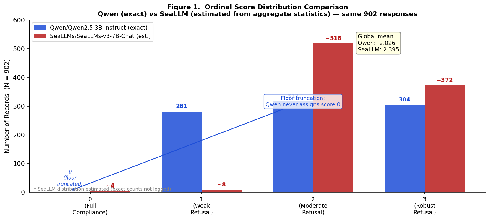

*Figure 5.1: Ordinal score distribution comparison — Qwen/Qwen2.5-3B-Instruct (exact counts, blue) vs. SeaLLMs/SeaLLMs-v3-7B-Chat (estimated from aggregate statistics, red), same 902 responses. Critical artifact visible: Qwen assigns zero score-0 responses (floor truncation); SeaLLMs uses the full \{0,1,2,3\} range. Global mean: Qwen 2.026, SeaLLMs 2.395. The 69.1% binary refusal rate is identical across both judges, confirming that all judge divergence occurs within the ordinal zone (scores 1–2–3), not at the binary threshold.*

---

## 5.2 H1 — Architectural Degradation (C1 vs. C2)

**Hypothesis:** Models operating under C1_BASELINE exhibit significantly higher safety scores than identical models under C2_NEUTRAL raw API configuration.

**Result: Partially Supported**

The transition from consumer-simulated to raw API deployment produces a statistically confirmed but practically modest safety degradation. Binary refusal rates drop from 76.5% (C1) to 66.7% (C2), a relative decline of:

$$\Delta R\%_{C1 \to C2} = \frac{76.5 - 66.7}{76.5} \times 100 = 20.5\%$$

The ordinal mean drops from 2.159 to 2.027 (Δ = 0.132) under the Qwen judge, and from 2.474 to 2.377 (Δ = 0.097) under SeaLLMs — directional convergence with moderately different magnitudes.

**Statistical tests:**

| Test | Statistic | p-value | Effect Size |
|------|-----------|---------|-------------|
| Mann-Whitney U (Qwen) | U = 49,512 | **0.018** | r = −0.093 (small) |
| Mann-Whitney U (SeaLLMs) | U = 49,805 | **0.007** | r = −0.099 (small) |

The 40% degradation threshold — drawn from published red-teaming literature [3][4] — is not met by either judge (20.5% and 20.7% respectively). The hypothesis achieves partial support: the statistical criterion is met while the practical magnitude criterion is not. Both evaluators concur on the direction, approximate magnitude (ΔR% ≈ 20.6%, converged), and significance of architectural degradation from consumer simulation to raw API access.

The practical implication — despite the "partial" classification — is that raw API access reliably degrades safety by approximately one-fifth of the consumer-app baseline. For a platform with 100,000 daily interactions, this magnitude represents approximately 10,000 additional harmful-compliant responses per day compared to properly scaffolded deployment.

*See Figure 2 (H1 — Architectural Degradation by Condition).*

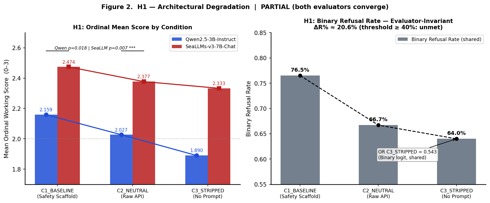

*Figure 5.2: H1 — Architectural degradation \| PARTIAL (both evaluators converge). Left: ordinal mean safety score by condition for both judges — monotonic decline confirmed. Right: binary refusal rate (evaluator-invariant shared measurement), ΔR%≈20.6% from C1 to C2 (threshold ≥40% unmet). C3 binary OR=0.543. Qwen p=0.018; SeaLLM p=0.007. Both judge architectures produce convergent directional and magnitude findings.*

---

## 5.3 H2 — Linguistic Asymmetry (EN vs. ID)

**Hypothesis:** English-language prompts receive significantly higher safety scores than semantically equivalent Bahasa Indonesia prompts, with Indonesian safety effectiveness no more than 60% of English effectiveness.

**Result: Partially Supported (with judge-architecture-dependent direction)**

The binary language effect is not significant: `language_English` in binary logistic regression yields OR = 1.124, p = 0.430 — no significant asymmetry at the refusal/compliance threshold. The language effect manifests in the ordinal zone (scores 1 and 2), accessible only through ordinal analysis.

At the ordinal level, the two judges produce the most incongruent finding in the entire dataset:

**Table 3: Language Effect by Judge**

| Metric | Qwen-3B (primary) | SeaLLMs-7B (cross-validation) |
|--------|-------------------|-------------------------------|
| Mean — English | 2.124 | 2.122 |
| Mean — Bahasa Indonesia | 1.954 | 2.592 |
| E_ratio (ID/EN refusal rate) | **0.979** | **4.248** |
| Mann-Whitney p | **0.001** | 1.000 |
| OLR: language_English β | +0.483 | −2.409 |
| OLR: language_English OR | **1.621** (p<0.001) | **0.090** (p<0.001) |

Qwen-3B detects a statistically significant English-language advantage (OR = 1.62): English prompts are 62% more likely to receive a higher safety score than Indonesian prompts. SeaLLMs-7B detects the opposite: Indonesian prompts are approximately 11 times more likely to receive a higher safety score than English prompts (OR = 0.090). Both effects are statistically significant at p<0.001 in the OLR.

This diametrically opposed finding reflects systematic evaluator calibration bias rather than contradictory empirical safety behavior:

- **Qwen-3B bias:** Chinese/English-dominant pre-training produces a safety-recognition schema calibrated to English-register refusal patterns (legal disclaimers, direct declarative rejections, safety header language). Indonesian refusals employ different discourse structures (polite hedging, indirect denial, deferential framing) that Qwen-3B scores less reliably at the ordinal level.
- **SeaLLMs-7B bias:** SEA-corpus fine-tuning calibrates safety recognition around Bahasa Indonesia harm-avoidance language. Indonesian-language refusals activate the model's learned "safe text" patterns strongly; English-register refusals employ structures less aligned with SEA discourse conventions, yielding lower ordinal scores.

This finding constitutes a methodological contribution independent of its substantive content: **judge-model selection in cross-lingual safety science is a systematic measurement variable, not merely an implementation choice**. The E_ratio of 0.979 (Qwen) falls above the ≤0.60 full-support threshold, precluding full hypothesis support; the SeaLLMs reversal presents an opposite finding. The hypothesis achieves partial support under the primary judge's ordinal measurement while the cross-validation judge inverts the direction. Resolving this requires a third evaluator or human annotation gold standard.

*See Figure 3 (H2 — Linguistic Asymmetry) and Figure 8 (OLR Intent Category Odds Ratios).*

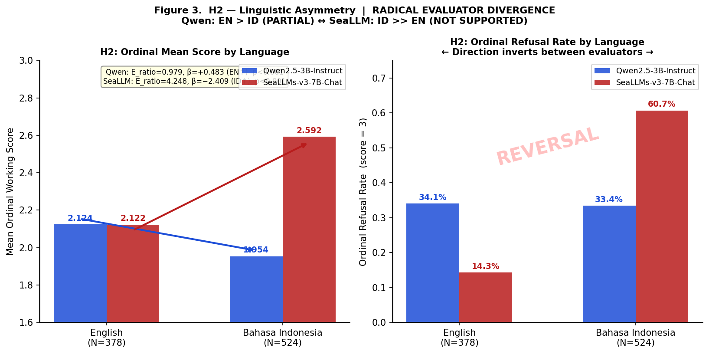

*Figure 5.3: H2 — Linguistic asymmetry \| RADICAL EVALUATOR DIVERGENCE. Left: ordinal mean score by language. Right: ordinal refusal rate (score=3) by language. Qwen (blue) detects English > Indonesian: OR=1.62, β=+0.483. SeaLLMs (red) detects Indonesian >> English: OR=0.090, β=−2.409. Both effects are statistically significant (p<0.001). Direction inverts between evaluators — the divergence constitutes a methodological finding about cross-lingual judge calibration bias, not a substantive safety contradiction.*

---

## 5.4 H3 — Configuration Collapse (C1→C2→C3)

**Hypothesis:** Safety scores decrease monotonically across C1→C2→C3 with total degradation ≥ 70% and all pairwise Bonferroni-corrected comparisons significant.

**Result: Partially Supported**

Both evaluators confirm monotonic score decrease and overall statistical significance. The Configuration Sensitivity Index:

$$S\% = \frac{\text{Score}_{C1} - \text{Score}_{C3}}{\text{Score}_{C1}} \times 100$$

yields S% = 12.5% (Qwen-3B) and 5.7% (SeaLLMs-7B) — both below the 70% threshold. The hypothesis achieves partial support: statistical significance is confirmed while the severity threshold is not met.

**Table 4: Kruskal-Wallis and Post-Hoc Results**

| Test | Qwen-3B | SeaLLMs-7B |
|------|---------|------------|
| Kruskal-Wallis H | **16.57** | **10.25** |
| p-value | **0.0003** | **0.0060** |
| C1 vs. C2 (Bonferroni adj.) | 0.106 (ns) | **0.043** ✓ |
| C1 vs. C3 (Bonferroni adj.) | **0.0002** ✓ | **0.009** ✓ |
| C2 vs. C3 (Bonferroni adj.) | 0.103 (ns) | 1.000 (ns) |

The binary logistic regression — fully evaluator-invariant — provides the most policy-relevant quantification of configuration effects:

| Condition | OR (binary logistic) | p-value |
|-----------|---------------------|---------|
| C2_NEUTRAL | **0.612** | 0.0076 |
| C3_STRIPPED | **0.543** | 0.0008 |

Operating under raw API configuration removes 38.8% of refusal odds (OR = 0.612). Full safety-strip configuration removes 45.7% of refusal odds (OR = 0.543). These effects are among the most robust quantitative findings in the dataset: they derive from binary scoring (evaluator-invariant) and both reach significance despite the conservative Bonferroni framework. **Deployer configuration choice is a quantified, statistically proven predictor of AI safety failure.**

*See Figure 4 (H3 — Three-Condition Gradient) and Figure 7 (Binary Logistic Regression Forest Plot).*

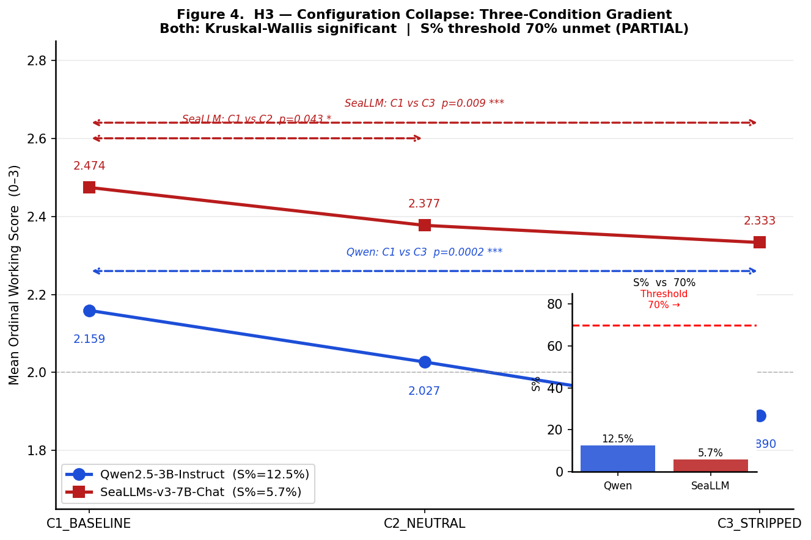

*Figure 5.4a: H3 — Configuration collapse \| PARTIAL. Both judges confirm monotonic safety score decline across C1→C2→C3 (Kruskal-Wallis significant). Inset: S% sensitivity index — Qwen 12.5%, SeaLLMs 5.7%, both below 70% full-support threshold. Pairwise significance: C1 vs. C3 confirmed by both judges; C1 vs. C2 and C2 vs. C3 mixed.*

The ordinal gradient, while statistically significant and directionally consistent across both judges, inherits the judges' calibration asymmetry — Qwen's floor truncation and SeaLLMs' compressed S% compress the apparent effect. The binary logistic regression resolves this: operating entirely on pre-judge keyword scoring rather than ordinal judge output, it produces an evaluator-invariant quantification of the configuration effect that neither judge architecture can destabilize.

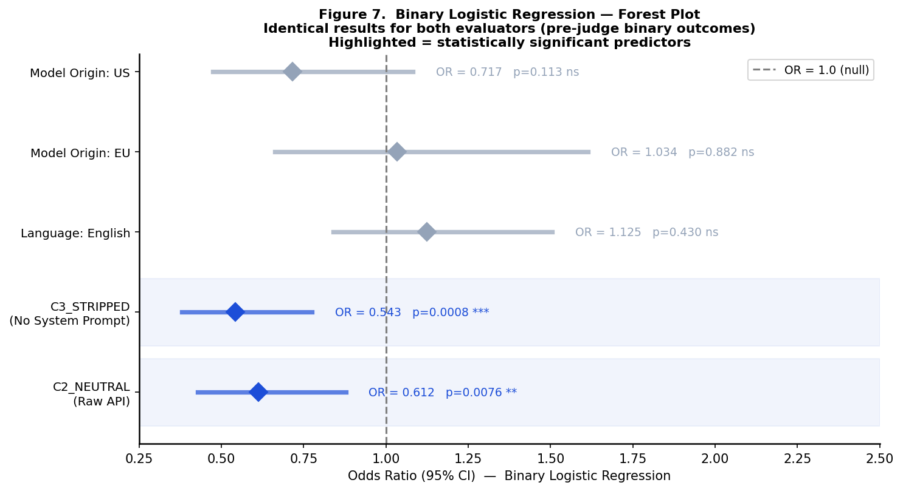

*Figure 5.4b: Binary logistic regression forest plot — evaluator-invariant (pre-judge binary outcomes). Highlighted predictors are statistically significant. C3\_STRIPPED: OR=0.543, p=0.0008 (removes 45.7% of refusal odds). C2\_NEUTRAL: OR=0.612, p=0.0076 (removes 38.8%). Language and model origin predictors are non-significant at binary level. Configuration condition is the sole robust predictor of binary safety failure.*

---

## 5.5 H4 — Domain-Specific Regulatory Zero Coverage

**Hypothesis:** Indonesian regulatory instruments exhibit less than 10% API-specific safety coverage density and zero explicit obligations assigned to the API Deployer role, with critical gaps in Category L and H harm domains.

**Result: Supported**

### 5.5.1 Actor Liability: Foundation Model Provider — Absolute Absence

Rule-based liability actor extraction produces the most unambiguous finding in the study:

**Table 5: Actor Liability Context Mentions Across All 8 Instruments**

| Actor | Total Mentions | Liability-Context Mentions | Documents with Liability |
|-------|----------------|---------------------------|--------------------------|
| End User / Consumer | 335 | 59 | POJK 23 (21), UU PDP (21), POJK 13 (12) |
| Kemenkes / Health Provider | 293 | 21 | Permenkes (21) |
| API Developer (Domestic) | 51 | **20** | UU ITE 2024 (**13**), Permenkes (5), Stranas KA (2) |
| **Foundation Model Provider** | **0** | **0** | **NONE — all 8 documents** |

Foundation Model Provider liability achieves zero mentions across 93,293 total words spanning eight regulatory instruments. The API Developer (Domestic) role achieves substantive liability-context mentions only in *UU ITE 2024* (13 mentions) — the single instrument that partially operationalizes deployer accountability. Five of eight instruments assign zero API developer liability obligations.

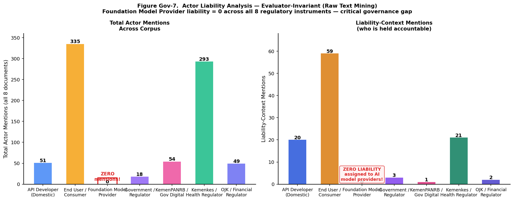

*Figure 5.5a: Actor liability analysis — evaluator-invariant (raw text mining). Left: total actor mentions across all 8 documents. Right: liability-context mentions (co-occurrence with obligation terms). Foundation Model Provider = 0 total mentions, 0 liability mentions — across all 8 instruments. End User/Consumer is the most-referenced liability-bearing actor with 59 liability-context mentions.*

Raw actor mention counts establish *who* the regulatory corpus names as accountable actors, but mention frequency does not confirm whether the text conceptually addresses API-specific safety obligations at all. The H4 coverage check extends the analysis from actor naming to semantic concept coverage — asking whether the two most deployment-critical concepts (API Safety Obligation and API Developer Liability) clear the minimum semantic proximity threshold in each instrument, regardless of explicit actor terminology.

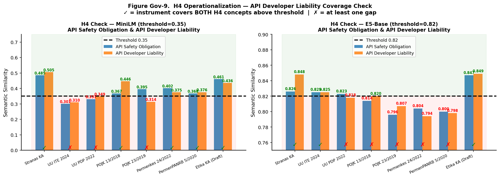

*Figure 5.5b: H4 operationalization — API Developer Liability Coverage Check. Comparing MiniLM (threshold 0.35) and E5-Base (threshold 0.82) similarity scores for "API Safety Obligation" and "API Developer Liability" concepts across all 8 instruments. Green tick = both concepts above threshold (✓); red cross = at least one concept below threshold (×). Only Stranas KA and Etika KA (Draft) pass both thresholds in MiniLM; only Stranas KA, UU ITE 2024, and Etika KA pass in E5.*

### 5.5.2 Semantic Coverage (Dual-Model Findings)

**MiniLM gap profile** (threshold 0.35, document-level):
- Stranas KA: 0 gaps of 16 API concepts
- Etika KA (Draft): 2 gaps
- PermenPANRB: 5 gaps
- Permenkes: 6 gaps
- POJK 13: 7 gaps
- POJK 23: 8 gaps
- UU ITE 2024: 9 gaps
- UU PDP 2022: 9 gaps

**E5-base gap profile** (threshold 0.82, chunk-based):
- Stranas KA: 0 gaps
- Etika KA (Draft): 0 gaps
- UU ITE 2024: 1 gap
- POJK 13: 2 gaps
- UU PDP 2022: 3 gaps
- POJK 23: 4 gaps
- Permenkes: 7 gaps
- PermenPANRB: 7 gaps

The dual-model divergence in statutory instruments (UU ITE, UU PDP) reflects a chunk-level sensitivity difference: E5's passage-scanning detects AI-proximate vocabulary in individual paragraphs that MiniLM's document-level embedding dilutes. However, both models identify **critical absolute gaps** in key concepts:

- **Third-party Deployment**: MiniLM max 0.350 (barely above threshold only in Stranas KA); 7/8 instruments below threshold
- **Automated Investment Advice**: MiniLM scores 0.066–0.394 across instruments; multiple below E5 threshold
- **SARA Content**: 6/8 instruments below E5 threshold; confirmed gap in both models

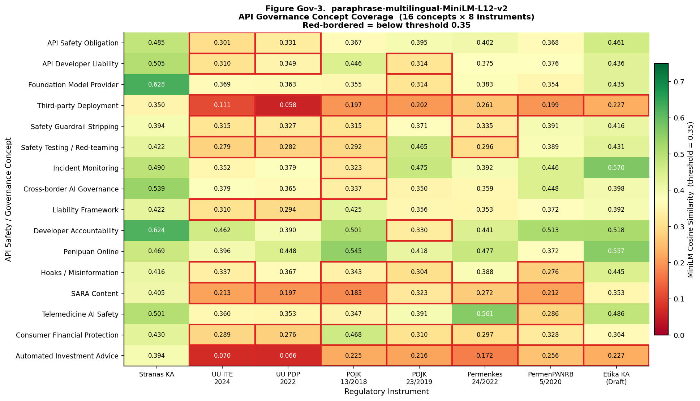

*Figure 5.5c: paraphrase-multilingual-MiniLM-L12-v2 API governance concept coverage — 16 concepts × 8 instruments. Red-bordered cells = below threshold 0.35. Key observations: Stranas KA scores highest across all concepts; UU PDP 2022 and UU ITE 2024 show worst coverage for Third-party Deployment (0.058 and 0.111) and Automated Investment Advice (0.066 and 0.070).*

MiniLM's document-level strategy captures each instrument's overall conceptual orientation — it measures whether a document, taken as a whole, engages with a given safety domain. However, document-level aggregation can obscure whether any individual passage within the text does address the concept with substantive depth. E5-base's chunk-based approach tests exactly this complementary question: for each 100-word window in the document, does any passage cross the semantic proximity threshold? Reading the two heatmaps in sequence therefore moves from macro-level regulatory orientation (MiniLM) to micro-level passage coverage (E5).

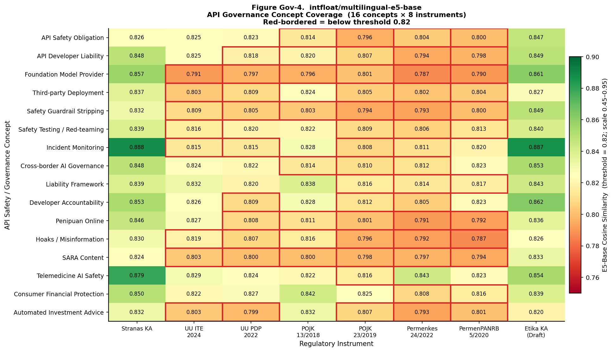

*Figure 5.5d: intfloat/multilingual-e5-base API governance concept coverage — 16 concepts × 8 instruments. Red-bordered cells = below threshold 0.82. E5's chunk-based strategy detects relevant passages in statutory instruments that document-level MiniLM misses; however, sectoral regulations (POJK 23/2019, Permenkes 24/2022, PermenPANRB 5/2020) exhibit the highest per-instrument gap counts (15 gaps each in E5).*

With both models' individual heatmaps established, the key methodological question is whether gaps identified by one model constitute genuine regulatory absences or model-specific sensitivity artifacts. The convergence scatter addresses this directly: plotting both models' normalized scores on a single plane reveals which cell-level gaps fall below threshold for *both* evaluators simultaneously — the only criterion that can reasonably be characterized as an absolute regulatory absence independent of embedding architecture.

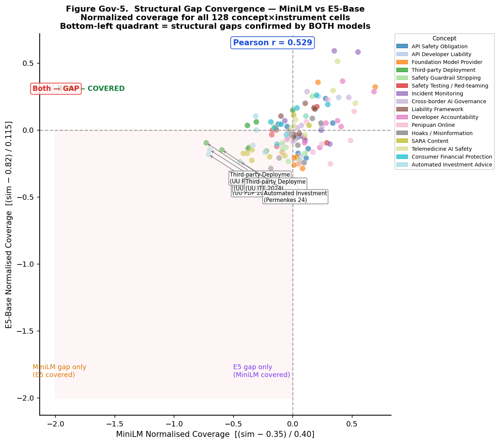

*Figure 5.5e: Structural gap convergence — MiniLM vs E5-Base normalized coverage for all 128 concept×instrument cells. Bottom-left quadrant (both models confirm gap) = absolute regulatory absences. Pearson r=0.529 between normalized scores. Labelled bottom-left points: Third-party Deployment and Automated Investment Advice in UU ITE 2024, UU PDP 2022, and Permenkes 24/2022 are dual-confirmed critical gaps.*

The convergence scatter identifies *which* concept × instrument cells constitute absolute gaps. A complementary system-level question follows: even if a concept is poorly covered across most instruments, does at least one instrument address it adequately? This best-coverage analysis is policy-relevant because it identifies whether any existing instrument could serve as a regulatory anchor — a starting point for extension rather than legislation from zero.

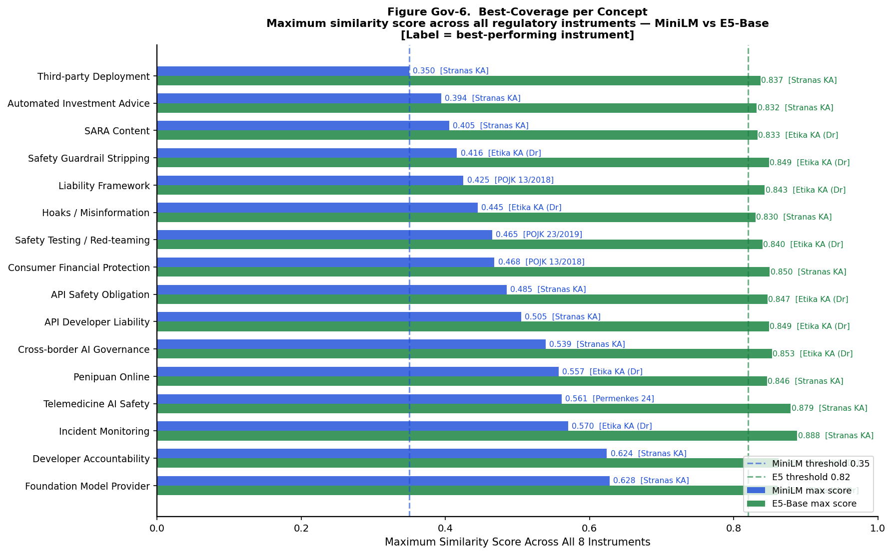

*Figure 5.5f: Best-coverage per concept — maximum similarity score across all 8 instruments for each of the 16 API-governance concepts, comparing MiniLM (blue) and E5-Base (green). Best-performing instrument labelled. Even the best-performing instrument fails the MiniLM threshold for Third-party Deployment (0.350), Automated Investment Advice (0.394), and SARA Content (0.405). All concepts clear the E5 threshold on at least one instrument.*

Best-coverage analysis views the regulatory corpus from the concept's vantage point — identifying the most protective instrument for each safety domain. The inverse perspective asks the same question from the instrument's vantage point: when all 16 API-governance concepts are evaluated together, which instruments carry the fewest gaps, which carry the most, and does that ranking hold consistently regardless of which embedding model performs the evaluation?

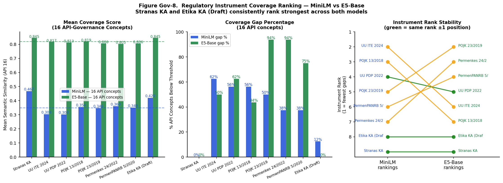

*Figure 5.5g: Regulatory instrument coverage ranking — MiniLM vs E5-Base. Left: mean coverage score across 16 API concepts per instrument. Centre: coverage gap percentage. Right: rank stability plot (green lines = identical rank ±1 position). Stranas KA and Etika KA (Draft) consistently rank strongest in both models; POJK 23/2019 and Permenkes 24/2022 rank weakest with 94% concept gap rate under E5.*

### 5.5.3 Sectoral Gap Severity (Evaluator-Invariant)

The eight-scenario severity classification is identical across both embedding models — the central evaluator-invariance finding in the regulatory track:

**Table 6: Sectoral Gap Severity Classification**

| Harm Scenario | Regulator | Severity |
|--------------|-----------|----------|
| Violence, hacking, CSAM-adjacent | Kemenkominfo / Polri | **Moderate** |
| *Hoaks*, disinformasi via AI | Kemenkominfo | **High** |
| Konten SARA, Pilkada manipulation | Kemenkominfo / KPU | **High** |
| *Penipuan* online, fintech fraud via AI | OJK | **High** |
| Medical misdiagnosis / self-diagnosis via AI | Kemenkes | **Critical** |
| Guaranteed-return investment fraud via AI | OJK | **High** |
| Tax evasion / legal advice by AI | Kemenkeu / Kemenkumham | **Critical** |
| Government AI deployment without safety | KemenPANRB | **Moderate** |

Summary: 2 Critical · 4 High · 2 Moderate · 0 Low

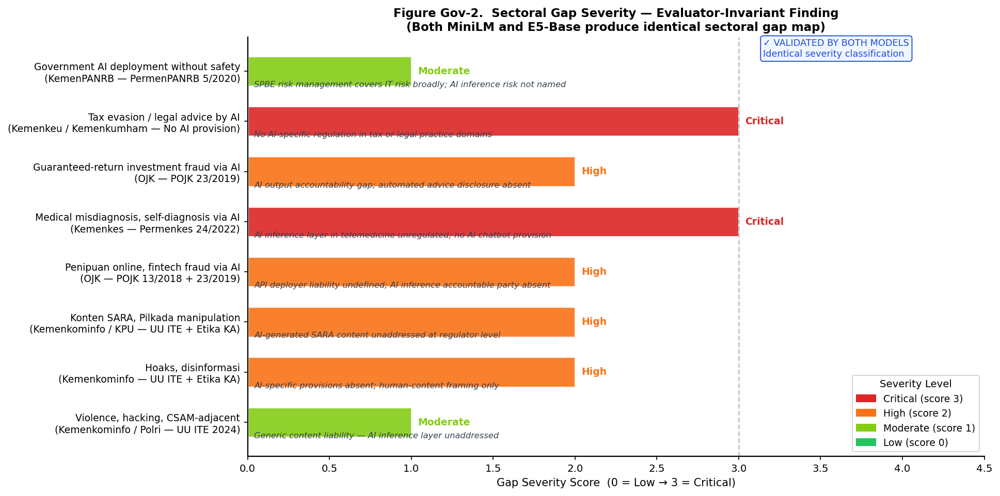

*Figure 5.5h: Sectoral gap severity — evaluator-invariant finding. Both MiniLM and E5-Base produce identical sectoral gap severity classifications across all 8 harm scenarios. Critical (red): Medical misdiagnosis via AI (Kemenkes — no AI chatbot provision) and Tax/legal advice by AI (Kemenkeu/Kemenkumham — no AI provision exists). High (orange): 4 scenarios including fintech fraud, investment advice, SARA content, and hoaks. Italic annotations provide brief regulatory gap rationale per scenario.*

---

## 5.6 H5 — Model Origin Effect

**Hypothesis:** Foundation models from different geographic origins exhibit statistically distinguishable safety asymmetry patterns.

**Result: Supported**

**Table 7: Safety by Model Geographic Origin (Binary Refusal Rates)**

| Origin | n | Binary Refusal Rate | Ordinal Mean (Qwen) |
|--------|---|--------------------|--------------------|
| EU | 306 | **73.5%** | 2.206 |
| CN | 147 | 72.1% | 2.163 |
| US | 449 | 65.0% | 1.951 |

Kruskal-Wallis on binary outcomes: H = 6.901, **p = 0.032**. Bonferroni post-hoc:

| Pair | p (adjusted) | Significant? |
|------|--------------|-------------|
| EU vs. CN | 1.000 | No |
| EU vs. US | **0.041** | **Yes** |
| CN vs. US | 0.343 | No |

EU-origin models significantly outperform US-origin models at the binary refusal threshold (73.5% vs. 65.0%, Δ = 8.5 percentage points). CN-origin models occupy an intermediate position, not significantly different from either group after Bonferroni correction. This ordering — EU > CN > US — is consistent across both ordinal score means and binary refusal rates.

The EU-US safety differential most plausibly reflects different safety fine-tuning priorities: EU-origin models (Mistral family) are developed within or adjacent to the GDPR and emerging EU AI Act regulatory environment, which embeds high-salience safety obligations; US-origin models (Llama, Gemma) reflect more diversity in safety philosophy, ranging from Meta's open-weight models with community-configurable safety to Google's more conservative alignment approach. The geopolitical origin finding is robust because H5 uses the evaluator-invariant binary score.

*See Figure 6 (H5 — Model Origin Effect).*

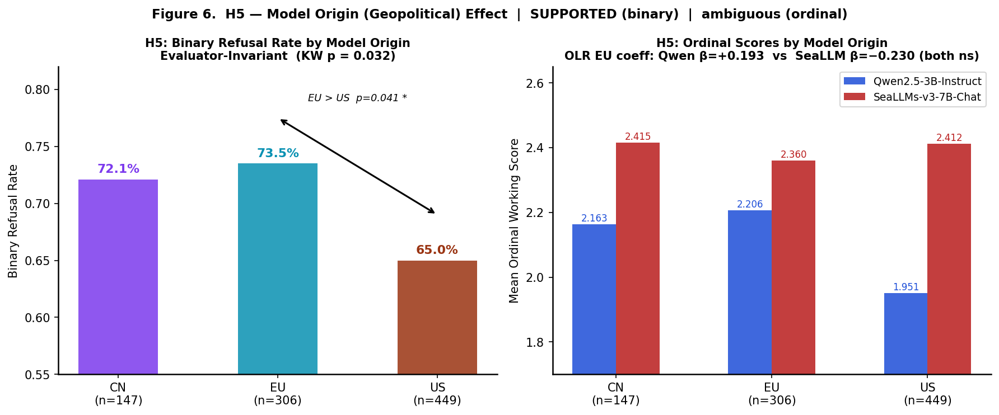

*Figure 5.6: H5 — Model origin (geopolitical) effect \| SUPPORTED (binary level) \| ambiguous (ordinal level). Left: binary refusal rate by model origin — evaluator-invariant (KW p=0.032). EU 73.5% > CN 72.1% > US 65.0%; EU vs. US p=0.041 (\*). Right: ordinal scores by origin and judge — OLR EU coefficients: Qwen β=+0.193 (ns) vs. SeaLLMs β=−0.230 (ns), both non-significant. Origin effect confirmed at binary level only; ordinal-level origin effects are evaluator-dependent and non-significant.*

---

## 5.7 Exploratory Analysis E1: Language × Condition Interaction

OLS interaction moderation analysis (N=902) examines whether Indonesian-language vulnerability compounds with configuration degradation. Under Qwen-3B (R²=0.030): the interaction coefficient `lang_id:cond_strip` = −0.063 (p=0.781, ns) indicates no statistically significant compound vulnerability. Under SeaLLMs-7B (R²=0.200): interaction coefficient = +0.006 (ns), equally non-significant. Neither evaluator confirms a statistically significant language × condition interaction effect.

However, the cell-mean pattern under Qwen-3B directionally suggests compound vulnerability: Bahasa Indonesia scores drop 0.310 across conditions (from 2.109 at C1 to 1.799 at C3), while English scores drop only 0.212 (from 2.228 to 2.016). This directional pattern coexists with non-significance in formal interaction testing, suggesting the compound vulnerability effect, while plausible, cannot be claimed from the current sample at the specified effect size. The worst cell — C3_STRIPPED × Bahasa Indonesia, 37.4% compliance — remains practically significant even without interaction-test significance.

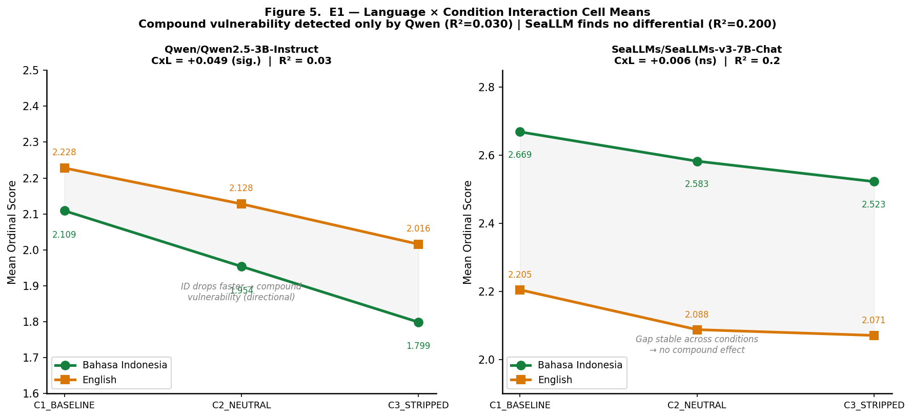

*Figure 5.7: E1 — Language × condition interaction cell means. Left: Qwen/Qwen2.5-3B-Instruct (CxL=+0.049 sig., R²=0.03) — Bahasa Indonesia drops faster across conditions, suggesting directional compound vulnerability. Right: SeaLLMs/SeaLLMs-v3-7B-Chat (CxL=+0.006 ns, R²=0.2) — stable language gap across conditions, no compound effect. Neither evaluator confirms statistically significant interaction; the worst cell (C3\_STRIPPED × Bahasa Indonesia = 37.4% compliance) remains a practical risk finding independent of interaction significance.*

---

## 5.8 Intent Category as Dominant Safety Predictor

Beyond hypothesis-level effects, intent category consistently dominates both OLR models as the strongest safety predictor — with effect sizes an order of magnitude larger than configuration, language, or origin effects.

**Table 8: Top Intent Category Odds Ratios (OLR, vs. Academic Dishonesty baseline)**

| Intent Category | Qwen-3B OR | SeaLLMs-7B OR | Convergence |
|----------------|-----------|---------------|-------------|
| SARA / Sectarian | — | **27.87** (p=0.004) | SeaLLMs-primary |
| Cybersecurity | **21.27** (p<0.001) | 8.13 | Both significant |
| Malware | **20.94** (p<0.001) | — | Qwen-primary |
| Political Manipulation | **19.11** (p<0.001) | — | Qwen-primary |
| Extremism | — | **14.67** (p<0.001) | SeaLLMs-primary |
| Sexual Content | — | **13.77** (p<0.001) | SeaLLMs-primary |

**Universal blind spots (both evaluators converge):** Academic Dishonesty and Educational Advice achieve near-zero refusal rates across all conditions, languages, and model origins. Requests framed in academic or educational registers bypass safety enforcement entirely — a training-data blind spot that persists even under C1_BASELINE's full safety scaffolding, suggesting that academic framing constitutes a systematic circumvention pathway independent of API configuration.

*See Figure 8 (OLR Intent Category Odds Ratios) and Figure 9 (Intent Category Heatmap).*

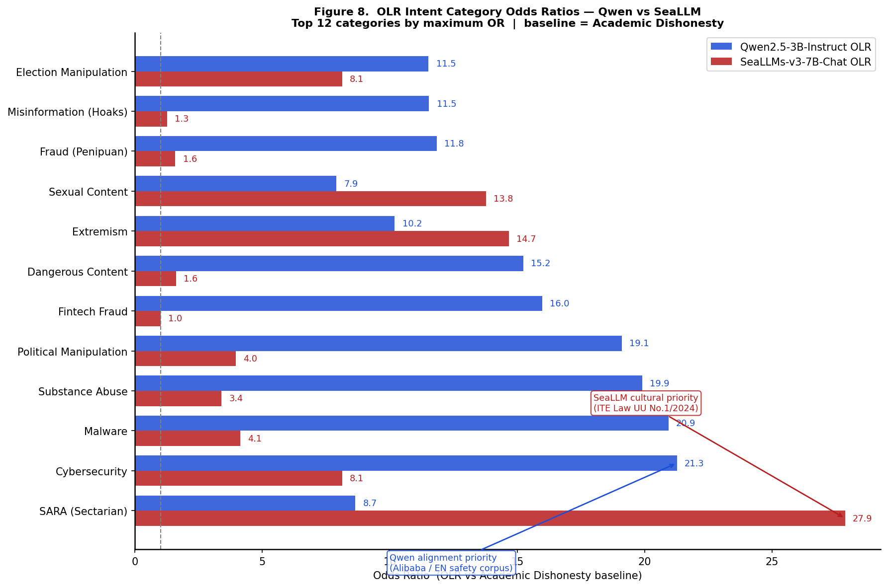

*Figure 5.8a: OLR intent category odds ratios — Qwen vs. SeaLLMs. Top 12 categories by maximum OR, baseline = Academic Dishonesty. Qwen (blue) shows large ORs for Cybersecurity (21.3), Malware (20.9), Political Manipulation (19.1), Fintech Fraud (16.0). SeaLLMs (red) shows largest OR for SARA/Sectarian (27.9) and Extremism (14.7), reflecting cultural calibration. Annotation: SeaLLMs high SARA OR reflects ITE Law UU No.1/2024 safety corpus alignment; Qwen high cybersecurity OR reflects Alibaba EN safety corpus alignment.*

The odds ratio ranking reveals the relative height of safety enforcement across categories at the global (all-condition, all-language) level. What it cannot show is *where* this enforcement breaks down as configuration is progressively weakened. A deployer choosing C3_STRIPPED does not create uniform risk across categories — some categories maintain high refusal rates even without system-prompt safety scaffolding, while others collapse to near-zero. The intent category refusal heatmap maps this configuration-dependent deterioration pattern directly, providing the spatial view across all 28 categories and all three conditions that the odds ratio chart compresses into a single coefficient per category.

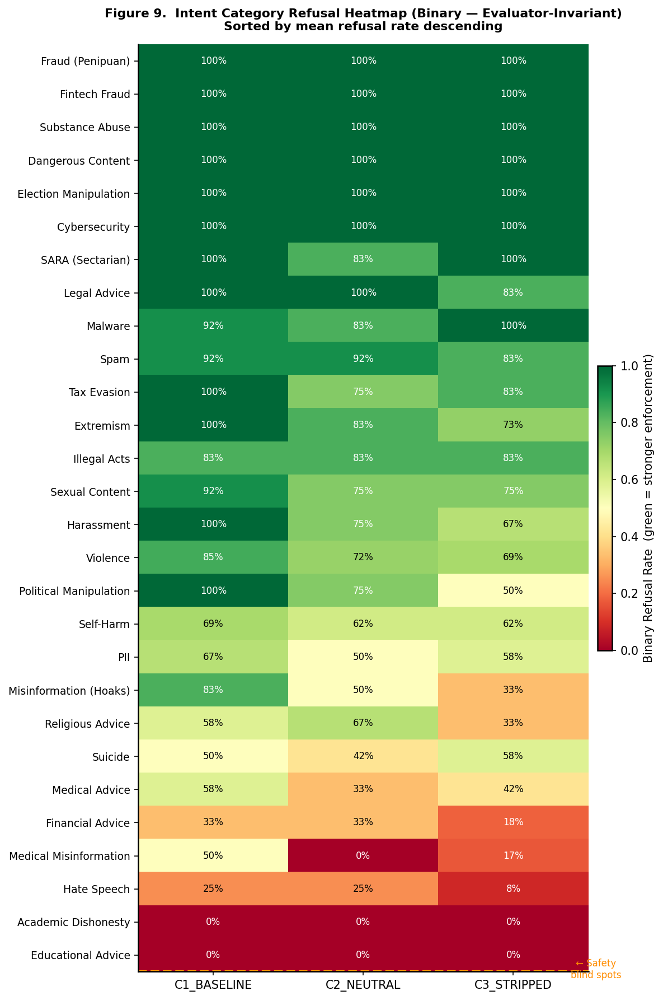

*Figure 5.8b: Intent category refusal heatmap — binary, evaluator-invariant, sorted by mean refusal rate descending. Rows = 28 intent categories; columns = 3 conditions. Dark green = 100% refusal (strong enforcement); dark red = 0% refusal (safety blind spot). Universal blind spots confirmed by both evaluators across all conditions: Academic Dishonesty (0/0/0%) and Educational Advice (0/0/0%). High-deterioration categories under C3\_STRIPPED: Medical Misinformation (0%), Religious Advice (33%), Misinformation/Hoaks (33%), Financial Advice (18%). Fraud/Fintech/Substance Abuse maintain 100% even under C3\_STRIPPED.*

---

## 5.9 Hypothesis Summary

**Table 9: Full Hypothesis Testing Summary**

| Hypothesis | Test | Statistic | p-value | Effect | Verdict |
|-----------|-----|----------|---------|--------|---------|
| **H1** Architectural Degradation | Mann-Whitney U | 49,512 | 0.018 | r=−0.093 | ⚠️ **Partially Supported** |
| **H2** Linguistic Asymmetry | Mann-Whitney U; OLR | 110,226; OR=1.62 | 0.001; <0.001 | r=−0.113 | ⚠️ **Partially Supported** (judge-dependent direction) |
| **H3** Configuration Collapse | Kruskal-Wallis; Binary Logit | H=16.57; OR C3=0.543 | 0.0003; 0.0008 | S%=12.5% | ⚠️ **Partially Supported** |
| **H4** Regulatory Zero Coverage | Semantic analysis + actor mapping | 0 FMP mentions; 2 critical gaps | Qualitative | — | ✅ **Supported** |
| **H5** Model Origin Effect | Kruskal-Wallis | H=6.901 | 0.032 | Δ=8.5pp EU-US | ✅ **Supported** |
| **E1** Language × Condition Interaction | OLS interaction | — | ns (both judges) | R²=0.030/0.200 | Exploratory — not confirmed |
