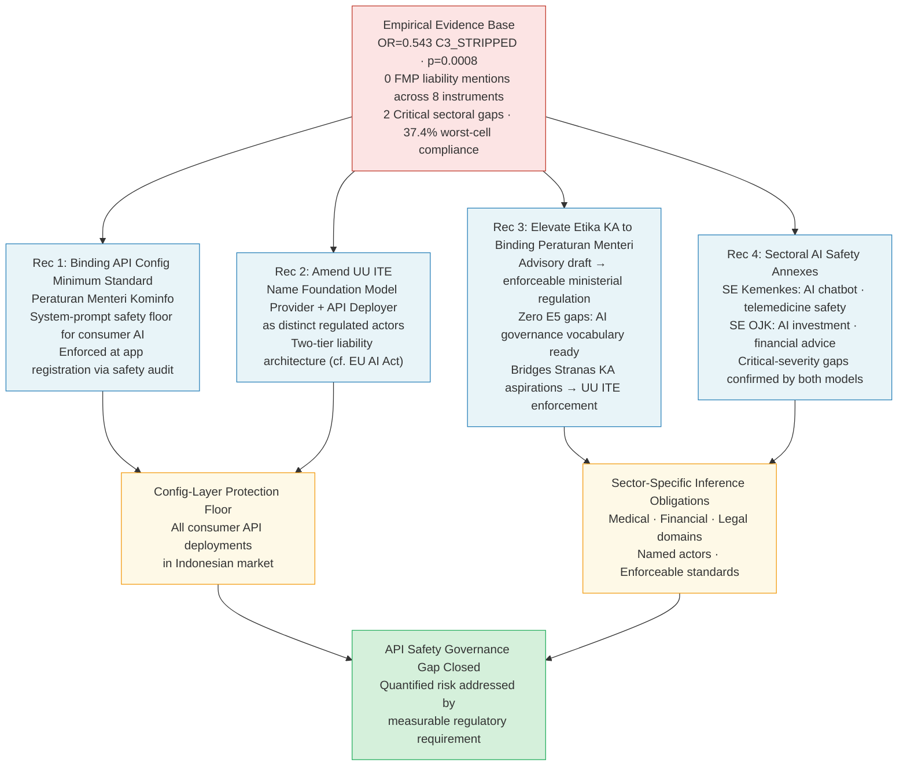

# Chapter 7: Conclusion

## 7.1 Research Questions Answered

This study set out to measure the magnitude and character of AI safety degradation in API-mediated deployment in Indonesia, and to assess whether Indonesia's regulatory instruments address the identified asymmetries. Four empirical findings answer these questions directly.

**RQ1 (Architectural Degradation):** Consumer-simulated deployment produces objectively safer outcomes than raw API deployment by the same models. The transition from full-scaffolding to raw API access degrades binary refusal rates by 20.5% (from 76.5% to 66.7%), with statistical significance confirmed by both judges (Qwen p=0.018; SeaLLMs p=0.007). The effect is real, reproducible, and quantified. The safety advantage of consumer simulation derives from the scaffolding layer, not from model weights — removing the scaffold removes approximately one-fifth of the safety protection present in properly deployed systems.

**RQ2 (Linguistic Asymmetry):** Cross-linguistic safety asymmetry exists at the ordinal scoring level but its direction is evaluator-dependent in a manner that constitutes a methodological finding rather than a substantive contradiction. Both evaluators confirm that binary refusal rates do not differ significantly by language (p=0.430); the asymmetry operates in the nuanced ordinal zone between partial and full refusal. The dual-judge design captures a phenomenon that single-judge designs cannot: the judge's own cultural calibration produces opposing directional verdicts. This finding mandates multi-evaluator designs for cross-lingual AI safety research.

**RQ3 (Configuration Sensitivity):** Progressive removal of safety configuration produces statistically confirmed monotonic safety degradation. The binary logistic model quantifies the configurational dimension precisely: raw API deployment removes 38.8% of refusal odds (OR=0.612); explicit safety stripping removes 45.7% (OR=0.543). Indonesian API integrators freely exercise these configuration choices with no regulatory constraint.

**RQ4 (Regulatory Zero Coverage):** Indonesia's eight-instrument regulatory corpus assigns zero liability to Foundation Model Providers, assigns API deployer obligations in only one of eight instruments (UU ITE 2024, with partial coverage), and leaves two high-stakes sectors — medical AI and tax/legal AI — with critical-severity regulatory gaps where no instrument assigns inference-layer safety obligations. The dual-model semantic analysis confirms the structural nature of these gaps: they persist across both document-level and passage-level evaluation paradigms.

**RQ5 (Model Origin Effect):** Geographic origin of foundation models constitutes a statistically significant safety moderator (p=0.032), with EU-origin models achieving 8.5 percentage points higher binary refusal rates than US-origin models (73.5% vs. 65.0%, Bonferroni p=0.041). The origin effect most plausibly reflects differential safety fine-tuning philosophies traced to the regulatory environments in which each model family was developed.

**RQ6 (Semantic Coverage Gap):** The dual-model semantic gap matrix reveals that Third-party Deployment, Automated Investment Advice, SARA Content, and Foundation Model Provider accountability are dual-confirmed gap concepts — semantically absent from both document-level and passage-level analysis across most instruments. Stranas KA is the sole instrument with zero gaps in both models, but its strategic rather than binding status means comprehensive semantic coverage translates to zero enforceable obligations.

**RQ7 (Digital Ecosystem Evidence):** Indonesia's digital ecosystem exhibits extensive API-mediated AI deployment — through startup platforms embedding commercial API connections, government digital service experiments, and consumer health and financial applications. The controlled experiment's risk findings thus describe a currently active deployment environment, not a hypothetical future scenario.

## 7.2 Theoretical Contributions

This study advances three theoretical positions:

**Contribution 1 — API-Mediated AI Safety Asymmetry as a Measurable IS Construct.** The theoretical framework introduces and empirically validates a construct that bridges Technical Safety Measurement Theory and Regulatory Gap Theory. The construct's four dimensions — architectural, observational, configurational, and temporal-domain — provide an analytical vocabulary for IS scholars studying AI safety in distributed deployment contexts. The configurational dimension receives the strongest empirical grounding: quantified, evaluator-invariant binary logistic odds ratios provide the measurement anchor.

**Contribution 2 — Evaluator-Invariance as a Validity Criterion in LLM-as-a-Judge Assessment.** By establishing a three-level invariance classification (binary-level invariant, ordinal within-language robust, ordinal cross-language evaluator-sensitive), this study provides a conceptual structure for IS research designs using automated LLM judges. The finding that cross-lingual ordinal safety conclusions are maximally evaluator-sensitive — producing opposite substantive verdicts from culturally distinct judges — constitutes a methodological contribution applicable beyond Indonesian contexts to any multilingual safety evaluation domain.

**Contribution 3 — Dual-Model Semantic Coverage as a Regulatory Analysis Method.** Applying divergent-architectural embedding models (distilled document-level MiniLM vs. contrastive chunk-level E5-base) as independent evaluators to a regulatory corpus provides a rigorous basis for identifying "absolute gaps" — concepts below threshold in both sensitivity regimes. This dual-model approach enriches Regulatory Gap Theory [2] by replacing qualitative gap assessment with quantified coverage scores and inter-model convergence as the validity criterion.

## 7.3 Policy Recommendations

The results generate four evidence-based reform recommendations, each grounded in specific numerical findings:

**Recommendation 1 — Enact a Binding API Safety Configuration Minimum Standard.** The binary logistic result (C3_STRIPPED OR=0.543, p=0.0008) provides quantified justification for a minimum system-prompt safety standard applicable to commercial AI API deployments in Indonesia. A *Peraturan Menteri Kominfo* requiring that AI systems accessed via API for consumer-facing services must implement system prompts that include minimum safety instructions (equivalent to a C1-comparable configuration baseline) would address the primary identified safety variable. Enforcement could be operationalized through mandatory safety testing logs submitted at application registration, analogous to security audit requirements in existing OJK fintech licensing.

**Recommendation 2 — Amend UU ITE to Name API Deployers and Foundation Model Providers as Distinct Regulated Actors.** Current UU ITE No. 1/2024 liability provisions reference "electronic system providers" but do not distinguish between foundation model providers (upstream, foreign, high safety design capacity) and API deployers (downstream, domestic, configuration-only control). Introducing this distinction in a legislative amendment would create a two-tier liability architecture mirroring the EU AI Act model: foundation model providers bear safety certification obligations for their models; API deployers bear configuration and monitoring obligations within their deployment scope.

**Recommendation 3 — Elevate the Etika KA Draft to Binding Ministerial Regulation.** The Konsep Pedoman Etika KA [16] achieves the highest AI safety semantic coverage of any instrument in the corpus (zero E5 gaps). Enacting it as a *Peraturan Menteri* — with explicit provisions defining API deployer obligations, safety configuration minimums, and sector-specific AI deployment requirements — would immediately close the most critical vocabulary gaps identified in the semantic coverage analysis, without requiring primary legislative amendment.

**Recommendation 4 — Commission Sectoral AI Safety Annexes for Permenkes and POJK.** Medical AI and tax/legal AI exhibit Critical-severity regulatory gaps confirmed by both embedding models and the actor liability analysis. Coordinated sectoral guidance — a *Surat Edaran Menkes* for medical AI chatbot safety and a *Surat Edaran OJK* for AI-generated investment and financial advice — would address these critical sectors without requiring legislative revision. The existing regulatory frameworks (Permenkes 24/2022 for telemedicine, POJK 13/2018 for fintech) provide the jurisdictional foundation; the necessary additions are AI-specific inference-layer safety obligations assigned to platform operators.

*Figure 7.1: Policy recommendation roadmap. Four evidence-based recommendations (blue) flow from the empirical evidence base (red) to two intermediate reform outcomes (yellow) converging on governance gap closure (green). Recommendations 1 and 2 address the configuration layer floor; Recommendations 3 and 4 address sector-specific inference obligations. Each recommendation is independently implementable without primary legislative amendment except Rec 2 (requires UU ITE amendment).*

## 7.4 Future Research Directions

Three research directions emerge from the limitations and findings of this study:

**Extension 1 — Human Annotation Gold Standard for Cross-Lingual Safety Calibration.** The H2 evaluator divergence motivates a human annotation study using a stratified sample of the 902 responses, annotated by bilingual Indonesian/English safety researchers blind to the judge scores. The resulting gold standard would enable calibration of the Qwen-3B and SeaLLMs-7B ordinal scales, determination of whether the English or Indonesian safety advantage is empirically real, and development of calibration coefficients for applying automated judges in Indonesian-language safety research.

**Extension 2 — Longitudinal API Safety Measurement.** Foundation models receive continuous safety training updates; model versions in deployment today will differ from model versions six months hence. A longitudinal replication of this protocol — re-running the same 902 prompt battery against version-updated models at quarterly intervals — would characterize the time-series dynamics of API safety asymmetry and determine whether provider safety improvements propagate to API-deployed versions at the same rate as consumer-application versions.

**Extension 3 — Qualitative Complementary Study on Indonesian API Integrators.** The quantitative findings establish what safety behaviors API-deployed models exhibit under controlled conditions; they do not establish why Indonesian API integrators choose particular configuration strategies (C1/C2/C3 equivalent) in practice. A qualitative study using semi-structured interviews with Indonesian startup founders and developers who deploy AI via API would characterize the organizational, resource, and knowledge factors that drive configuration choices — providing the qualitative depth needed to translate the quantitative safety gap measurements into practically actionable capacity-building interventions.

## 7.5 Closing Statement

Indonesia's AI adoption trajectory proceeds at national-strategy scale. The empirical evidence this study generates — a 30.9% overall harmful-content compliance rate, rising to 36.0% under safety-stripped configuration, with Foundation Model Provider liability at zero across all eight regulatory instruments — describes not a possible future risk but a present governance failure. The analytical tools this study contributes — a validated dual-LLM evaluation methodology, a dual-model semantic coverage framework, a quantified API safety asymmetry construct — equip researchers and policymakers with the measurement infrastructure to characterize, track, and ultimately close Indonesia's API safety governance gap.

The safety asymmetry identified here is configurable. The configuration layer that drives safety outcomes is under domestic regulatory reach. The regulatory instruments needed to address it are partially drafted *in the Etika KA text*. What remains is the political will to translate measurement into mandate.
